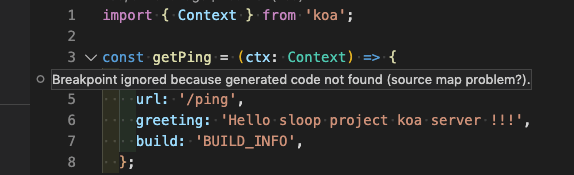
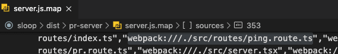
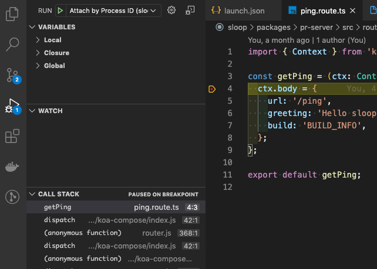
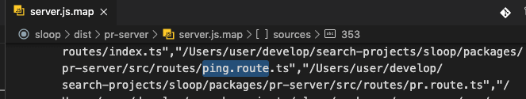
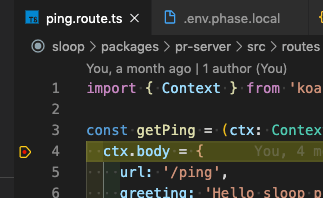

### 소개

node project을 진행중에 폴더 구조 변경 이후 아래와 같이 "breakpoint ignored" 가 발생하면서, 코드 디버깅을 IDE(vscode, intellij, 등)에서 하지 못하는 문제가 발생하였다. 하여 해당 문제의 발생 원인 및 해결 방법에 대해서 간략하게 설명한다.



### 원인

해당 문제가 발생하는 이유는 ts이건 js이건 빌드 이후 생성한 debug용 "*.map" 파일에 기록되어 있는,  **원본(original) 코드 위치 및 loader위치가, 실제 해당 프로젝트의 원본 코드(original code)의 위치가 맞지 않아서 발생**하는 문제이다.

해당 문제가 발생했을때, 상황을 좀더 빠르게 확인하려면, dubug용 빌드시 명확하게 path가 보이는 옵션으로 빌드하여 "*.map" 파일을 열어서 확인해보는게 좋다.

```jsx
// webpack을 사용하는 경우 devtool 설정을 "source-map" 으로 한다.
{
  devtool: "source-map",
}
```

문제가 발생하는 경우 예제

- 원본 소스 위치: /packages/pr-server/src/routes/ping.route.ts
- 디버그 map파일에 기록된 소스 위치: webpack:///./src/routes/ping.route.ts
- 빌드 결과 위치
    - /dist/pr-server/server.js
    - /dist/pr-server/server.js.map




위 예제와 같은 경우 IDE(vscode, intellij, 등)에서는 map파일에 기록된 소스 위치로 원본 소스를 찾게 되는데, 실제 위치에 해당 파일이 없기 때문에 debug point가 정상 동작하지 않게 된다.

### 해결 방법

원인이 명확하기 때문에 원인을 해결하면 문제를 해결 할 수 있다. 원인을 해결 하는 방법은 아래와 같이 2가지가 존재 할 수 있다.

1. **IDE에서 map파일에 기록된 path을, 실제 original source file 위치로 다시 mapping**
2. **build시점에 debug용 source map을 생성할때, 명확한 source path로 map파일이 생성되도록 설정**

사용하고 있는 IDE와, bundler에 따라서 조금씩 방법이 다르겠지만, 핵심은 결국 위 2가지 방법으로 해결 할 수 있다. 여기서는 IDE(vscode) 인 경우와, bundler(webpack)인 경우 해결 방법에 대해서 설명한다.

**IDE(VSCode)설정을 이용해서, debug 파일(*.map)의 path을 설정하기**

VSCode의 경우 debug launch을 할때, "launch.json" 에 debug run configuration을 설정할 수 있다. 이때  launch.json의 "sourceMapPathOverrides" 설정을 이용해서, debug point 미스 매칭을 해결 할 수 있다.

```jsx
// vscode의 launch.json 설정 예제
{
  "version": "0.2.0",
  "configurations": [
    {
      "type": "node",
      "request": "attach",
      "name": "Attach by Process ID",
      "protocol": "inspector",
      "port": 9331,
      "restart": true,

      // 아래 3개의 설정을 추가해 주면 된다. 그중 핵심은 "sourceMapPathOverrides" 설정이다.
      "sourceMaps": true,
      "trace": true,
      "sourceMapPathOverrides": { "webpack:///./src/*": "${workspaceRoot}/packages/pr-server/src/*" }
    }
  ]
}
```

위 예제의 경우, 디버그 "*.map" 파일에 **미스 매칭된 relative path을 실제 origin source code path로 설정**해 주고 있다.

이후 vscode에서 debug launch을 시도해보면 정상적으로 debug point가 기동됨을 확인 할 수 있다.




**Bundler(Webpack)설정을 변경하여, debug 파일(*.map)생성시 path을 명확하게 설정하기**

webpack의 경우, debug 설정을 "devtool" 을 사용하게 되어 있는데, 이때 output설정에 "devtool"의 부가 설정이 가능하다.

참고: [https://webpack.js.org/configuration/output/#outputdevtoolmodulefilenametemplate](https://webpack.js.org/configuration/output/#outputdevtoolmodulefilenametemplate)

가장 간단한 방법은 아래 예제와 같이 **webpack의 output설정중 devtoolModuleFilenameTemplate 설정을 absolute path로** 주는 형태이다.

예제

```jsx
// webpack.config.js
{
  devtool: "source-map",
  output: {
    path: path.resolve(rootPath, `dist/${packageJSON.name}`),
    filename: '[name].js',
    chunkFilename: '[name].js',
    // 아래 devtoolModuleFilenameTemplate 설정이 핵심이다.
    devtoolModuleFilenameTemplate: '[absolute-resource-path]',
  },
...
}
```

위 예제와 같은 형태로 build시도시 아래와 같이 absoulte path설정이 된 debug "*.map" 파일을 볼 수 있다.




해당 설정에서 IDE의 기본설정으로 아래와 같이 break point가 정상 동작됨을 확인 할 수 있다.




### 요약

- 원인: debug 정보상 원본 source 에 대한 path 미스 매칭
- 해결: path미스매칭을 맞추어 주면 됨
    - IDE의 debug run 설정에서 맞추거나
    - Bundler에서 debug 모드 빌드시 map 파일의 path설정을 맞추어 줌
- 추가: 각 IDE와 bundler마다 설정방법이 다를수 있다. 해당 부분은 잘 찾아서 맞추어 주어야 한다. 여기서는  vscode와 webpack 사용시 해결방법에 대하여 설명하였다.


```toc

```
