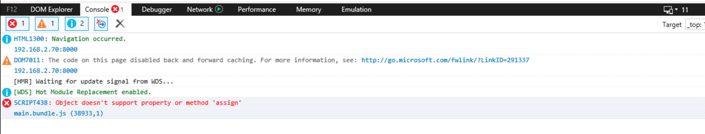

### 소개

polyfill 와 transform을 이용하여 브라우저 하위환을 맞추는 방법에 대해서 간략하게 설명합니다.

### 브라우저 하위호환?

javascript 언어가 발전하고, 해당 언어가 구동되는 browser역시 발전하면서, 최신 javascript언어의 문법이 old 브라우저에서는 구동 안되는 문제가 발생하게 되었습니다. 이를 해결하여, 최신 javascript언어 & 문법을 사용해도, old 브라우저에서 구동되게 하는것이 브라우저 하위호환 입니다.

old 브라우저에서 지원하지 않는 javascript사용시 아래와 같이 구문에러가 발생하게 됩니다.



### 하위호환을 하는 방법

결론적으로 보면, old 브라우저에서 구동 가능한 형태로, 현재 구현되어있는 javascript을 변경(transform)해 주거나, 미지원 내장 함수에 대해서 javascript level에서 해당 함수를 직접 구현하여 넣어주는 형태(polyfill)로 가능합니다. 이밖에  실제 코드가 구동되는 run-time에 실시간으로 변경처리도 가능하지만 real(deploy)환경에서는 성능이슈등이 있음으로 추천되지 않습니다(물론 경우에 따라서 유연하게 사용가능합니다).

### Polyfill

old 브라우저에서 미지원되고 있는 내장 함수나 기능을 넣어주는 방식 입니다.

예를들어, Object.assign 은 es6(ECMA 2015) 문법으로, 아래와 같이 **IE10이하에서는 지원되지 않습니다**.

참고: [https://caniuse.com/#search=object.assign](https://caniuse.com/#search=object.assign)


따라서 **해당 기능(Object.assign)을 IE10 이하에서 지원하고 싶다면**, '본인이 직접 Object.assign'을 구현하거나, 구현된 하위호환용 Object.assign을 적용해 주면 됩니다.

```jsx
// 직접 구현했다고 가정했을때..., Object.keys랑 arrow fn은 있다고 가정

Object.assign = (a, b) => {
  let newObj = {};
  Object.keys(a, (key) => newObj[key] = a[key]);
  Object.keys(b, (key) => newObj[key] = b[key]);
  return newObj;
};

// 위 로직이 구동된 이후에 Object.assign은 구문에러가 나지 않음.
```

Polyfill의 기본 컨셉은 위와 같이 old browser에서는 browser객체(함수)로 존재하지 않는 기능을 직접 넣어줍니다.

위의 예제를 보면 알겠지만 문제는, 이 직접 만든 구현체의 내용역시 old browser에서 구동되는 형태로 만들어야 하고, **해당 구현체의 로직이 탄탄해야(메모리 누수가 없고, spec을 모두 지원하고, 등등...)**합니다.

실제 위 Object.assign의 polyfill을 검색해보면 아래와 같이 여러가지 polyfill구현체를 찾아 볼 수 있습니다.

- Object.assign 여러 polyfill 구현체들
    - [https://github.com/rubennorte/es6-object-assign](https://github.com/rubennorte/es6-object-assign)
    - [https://github.com/christiansany/object-assign-polyfill/blob/master/index.js](https://github.com/christiansany/object-assign-polyfill/blob/master/index.js)
    - [https://vanillajstoolkit.com/polyfills/objectassign/](https://vanillajstoolkit.com/polyfills/objectassign/)
    - [https://github.com/zloirock/core-js/blob/master/packages/core-js/internals/object-assign.js](https://github.com/zloirock/core-js/blob/master/packages/core-js/internals/object-assign.js)  (babel에서 사용)
    - 등등...

사실 여러 구현체들중 본인 기능에 문제 없이 동작한다면 어떤걸 사용해도 무방합니다. 하지만 가장 많이 사용한 어느정도 검증된 방식이 bable의 polyfill을 사용하는 방식입니다.

### Transform

old브라우저에서 미지원되고 있는 함수나 문법을 지원되는 함수나 문법으로 코드를 변경해 주는 방식입니다.

polyfill와는 다르게 원본 코드자체가, old browser에서 구동되는 형태로 바꾸어서 들어가게 됩니다. 예를 들어 arrow function은 es6(ECMA 2015) 문법으로, 아래와 같이 **IE11이하에서는 지원되지 않습니다**.

참고: [https://caniuse.com/#feat=arrow-functions](https://caniuse.com/#feat=arrow-functions)


이경우 함수 레벨이 아닌 문법 자체가 미지원되고 있기 때문에 원본 코드가 바뀌어야 합니다.

```jsx
// 아래와 같은 코드가 있다면
const gseok = {
  arrowFnTest: () => console.log('test')
};

// 변경되어서 IE11도 이해할수 있는 문법으로 코드 자체가 바뀌어야함
var gseok = {
  arrowFnTest: function arrowFnTest() {
    return console.log('test');
  }
};
```

 transform의 경우, 개발자가 애시당초 old 브라우저에서 지원되는 문법으로 개발하지 않는한, **수동으로 코드를 변경하기는 거의 불가능**하기 때문에, **보통 빌드 시점에 javascript code compiler을 통해서**, 최신코드 → old 브라우저가 이해가능한 코드, 로 변환해서 적용하게 됩니다.

이때 사용하게 되는 **javascript code compiler가 업계 de facto인 babel**이 됩니다.

### How?

브라우저 하위 호환 개념과 두가지 방식에 대해서 알아보았습니다. 해당 방식을 실제 어떤식으로 적용해야하는지에 대해서 설명합니다.

Polyfill을 직접 구현해서 넣어주거나, Transform이 불필요하게 애시당초 old 브라우저가 이해하도록 구현할 수도 있지만, 보통 최신 javascript 문법으로 프로젝트를 구현하고, 빌드 시점에 compiler을 통해서 이를 변경하는 형태를 취하게 됩니다.

여기서는 거의 업계 표준(de facto)인  **babel을 이용해서 polyfill 및 transform**을 하는 방식을 간략하게 설명합니다.

### **babel 기본 개념**

babel은 javascript compiler로 원본 js(or ts)을 받아서 설정된 option(빌드 config) 에 따라서 컴파일된 결과물을 생성합니다.

```jsx
// babel
original.js → babel → compiled.js

// java
[original.java](http://original.java) → javac  → original.jar
```

보통 다른 언어의 컴파일러처럼 babel역시 **cli로 컴파일을 수행 할 수 있습**니다.

```jsx
$ npx babel a.js --out-file a-compiled.js --config-file babel.config.json
```

참고: cli [https://babeljs.io/docs/en/babel-cli](https://babeljs.io/docs/en/babel-cli)

참고: configfile [https://babeljs.io/docs/en/config-files](https://babeljs.io/docs/en/config-files)

### babel 번들러와 같이 쓰기

babel이 defacto이기 떄문에 거의 모든 번들러에서는 babel compile을 지원합니다. 여기서는 webpack 번들러를 사용했을때 babel을 적용하는 방법에 대해서 설명합니다.

**webpack.config.js**

```jsx
module: {
      rules: [
        {
          test: /\.tsx?$/,
          use: [
            {
              loader: 'babel-loader',
              options: {
                presets: [
                  [
                    '@babel/preset-env',
                    {
                      targets: {
                        browsers: ['last 2 versions', 'ie >= 8'],
                      },
                      debug: true,
                      useBuiltIns: 'usage',
                      corejs: { version: 3, proposals: true },
                    },
                  ],
                  '@babel/preset-react',
                ],
              },
            },
            {
              loader: 'ts-loader',
              options: {
                configFile: path.resolve(__dirname, './tsconfig.json'),
              },
            },
        }
     ]
}
```

- webpack에 babel-loader을 적용하면, cli을  통해서  compile을 하는것과 동일하게, 코드를 compile할 수 있습니다.
- 해당 loader의 option설정은 cli을 통해서 compile할때 적용하는 babel의 config설정과 동일합니다.

**@babel/preset-env?**

polyfill이나, transform을 할때, 각각의 종류와 type이 여러개가 존재하게 됩니다. 해당 polyfill이나, transform을 하나의 set로 묶어서 제공하는게 babel의 preset-env입니다.

```jsx
// e.g) 아래와 같은 부분이 다 set으로 묶여서 같이 들어 있음!
core-js(-pure)/es|stable|features/string
core-js(-pure)/es|stable|features/string/from-code-point
core-js(-pure)/es|stable|features/string/raw
core-js(-pure)/es|stable|features/string/code-point-at
core-js(-pure)/es|stable|features/string/ends-with
core-js(-pure)/es|stable|features/string/includes
core-js(-pure)/es|stable|features/string/starts-with
core-js/es|stable|features/string/match
core-js(-pure)/es|stable|features/string/match-all
core-js(-pure)/es|stable|features/string/repeat
core-js(-pure)/es|stable|features/string/pad-start
core-js(-pure)/es|stable|features/string/pad-end
core-js/es|stable|features/string/replace
core-js/es|stable|features/string/search
core-js/es|stable|features/string/split
core-js(-pure)/es|stable|features/string/trim
core-js(-pure)/es|stable|features/string/trim-start
core-js(-pure)/es|stable|features/string/trim-end
core-js(-pure)/es|stable|features/string/trim-left
core-js(-pure)/es|stable|features/string/trim-right
core-js(-pure)/es|stable|features/string/anchor
core-js(-pure)/es|stable|features/string/big
core-js(-pure)/es|stable|features/string/blink
...
```

babel의 예전 버전에서는, 개발자가 필요한 polyfill이나 transform을 직접 하나씩 설정하는 형태를 취했는데, babel 버전이 올라가고, corejs을 사용하면서, corejs을 활용한 형태로 변경되었습니다.

참고: [https://babeljs.io/docs/en/babel-preset-env](https://babeljs.io/docs/en/babel-preset-env)

**실제 polyfill 및 transform 설정**

useBuiltIns

- 기본값은 false입니다. 'entry'나 'usage'을 사용할 수 있고, 실제 polyfill파일인 core-js을 같이 설정해주어야 합니다.
- entry

    ```jsx
    // entry 포함방식과 동일합니다. 즉 아래 case는 모두 동일합니다.

    // 1. webpack.config.js에 entry 활용
    {
      entry: ['core-js', '/src/index.js']
    }

    // 2. 실제 소스 코드의 entry 코드에서 import
    // index.js라고 가정했을때, 해당 파일 최상단에
    import 'core-js';

    // 3. webpack의 bable-loader의 babel-preset-evn의 useBuiltIns 설정
    {
      loader: 'babel-loader',
      options: {
        presets: [
          [
            '@babel/preset-env',
            {
              targets: {
                browsers: ['last 2 versions', 'ie >= 8'],
              },
              debug: true,
              useBuiltIns: 'entry',
              corejs: { version: 3, proposals: true },
            },
          ],
          '@babel/preset-react',
        ],
      },
    },
    ```

- usage
    - 기존 entry방식은 현재 내 코드에서 필요한 polyfill이나 transform이외 불필요한 모든 polyfill와 transform이 같이 추가되는 문제가 있음.
    - usage을 사용하면, entry포인트로부터 모든 파일을 탐색하면서 해당 파일에 필요한 polyfill와 transform을 추리고, 해당 부분을 중복되지 않게 추가해줍니다.

    


- usage와 직접 polyfill 추가 복합 사용도 가능합니다.

    ```jsx
    // entry 파일에 import
    import 'core-js/es/map';
    import 'core-js/es/set';
    import 'core-js/es/object/assign';

    // webpack에서 usage
    [
      '@babel/preset-env',
      {
        targets: {
          browsers: ['last 2 versions', 'ie >= 8'],
        },
        debug: true,
        useBuiltIns: 'usage',
        corejs: { version: 3, proposals: true },
      },
    ],
    ```


```toc

```
