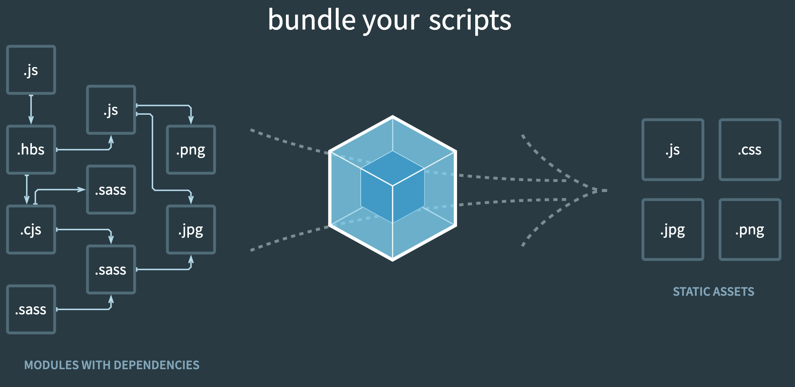
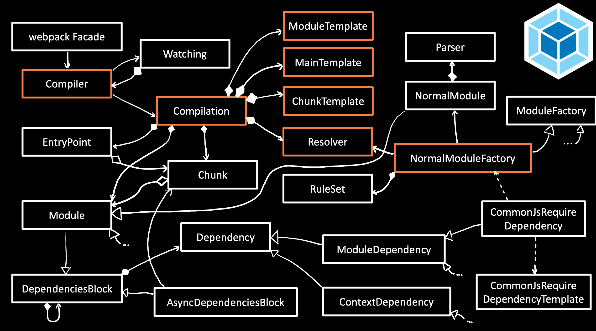
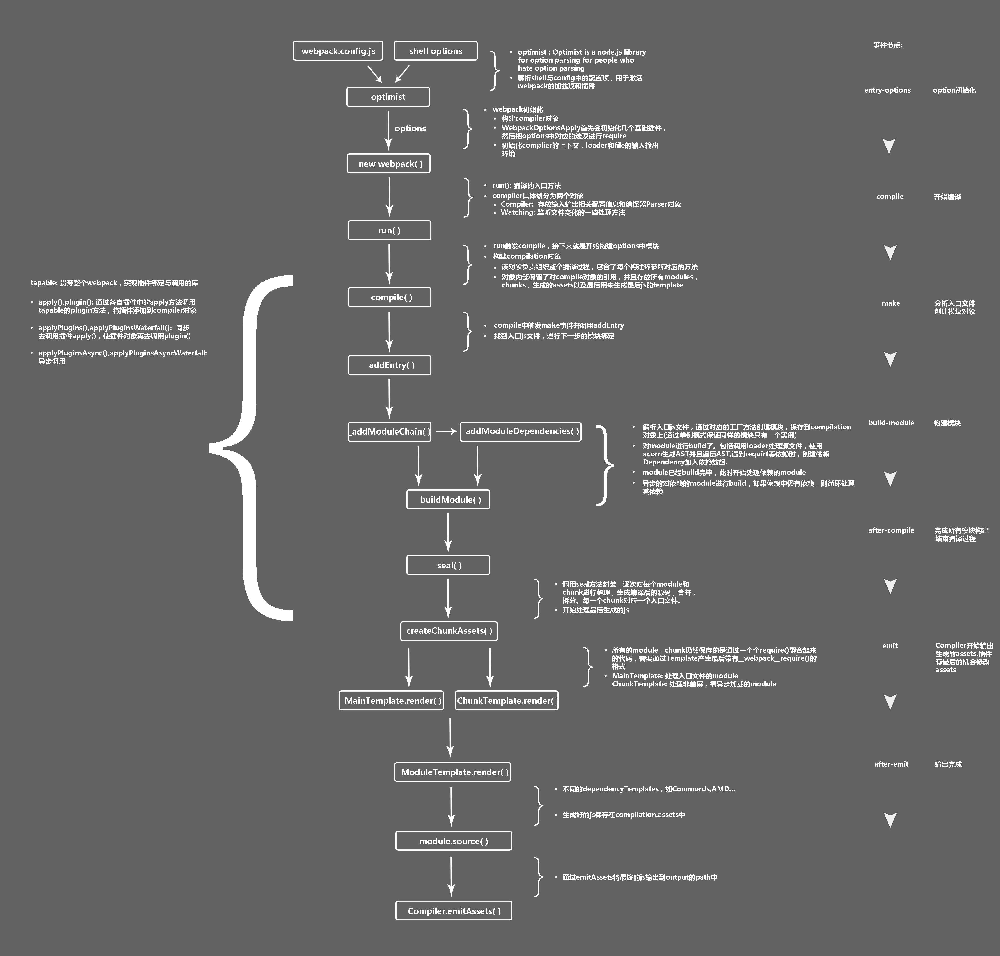

### 소개

webpack의 기본 개념과, webpack config을 구성하는 요소들을에 대한 개념을 이해합니다. 이를 통하여 직접 webpack 빌드 구조를 구현하거나, 이미 구현된 webpack 빌드를 이해할 수 있도록 합니다.

### Webpack 의 기본 개념

**what is webpack?**

참고:



**webpack**은 최신 javascript application을 위한 module bundler 입니다. webpack은 내부적으로dependency graph 을 각각의 모듈별로 생성하고, 해당 정보를 이용하여 최종적으로 한개 또는 여러개의 bundle을 생성합니다.

webpack은 node 프로그램입니다. 이는 webpack이 javascript로 구현되어 있고, 실질적으로는 node app.js을 수행하듯, node webpack.js 형태로 수행된다는 것을 의미합니다. 실제 webpack의 code을 살펴보면 shebang 형태로 webpack entry point가 구성되어 있음을 알 수 있습니다. 참고: [https://github.com/webpack/webpack/blob/master/bin/webpack.js](https://github.com/webpack/webpack/blob/master/bin/webpack.js)

**webpack lifecycle?**

react나 vue처럼 명확한 문서로 정의된 lifecycle은 없지만 webpack문서의 hook와 문서 내용을 통해서 개략적인 webpack lifecycle을 알 수 있습니다.

 참고

- [https://raw.githubusercontent.com/sokra/slides/master/data/how-webpack-works.pdf](https://raw.githubusercontent.com/sokra/slides/master/data/how-webpack-works.pdf)
- [https://webpack.js.org/api/compiler-hooks/](https://webpack.js.org/api/compiler-hooks/)
- [https://github.com/fanjunzhi/lifecycle-webpack-plugin](https://github.com/fanjunzhi/lifecycle-webpack-plugin)



- 좀더 정리된 step으로 보면 아래와 같습니다.



webpack은 앞서 이야기 하였듯, javascript로 구현되어 있고, 내부적으로는 oop의 컨셉 및 plugin 구조을 사용하고 있습니다. 또한, 각 step별 hook을 제공하고 있어, 사용자가 필요한 번들 옵션이나 처리를 할 수 있도록 제공하고 있습니다.

사실 일반적인 빌드 상황에서 hook이나 loader 혹은 plugin을 제작하는일은 거의 없을듯 합니다. 이미 대부분의 필요한 loader나 plugin이 구현되어 존재하고, 해당 구현체들의 이용으로 대다수의 문제가 해결 가능합니다.

하지만 특이한 경우나, 특별한 경우, 기존 구현체로 해결 못하는 문제가 있을 수 있고, 이경우 webpack의 기본적인 개념과 컨셉을 이해하는것이 이러한 문제를 해결할때 도움이 됩니다. 물론 이러한 개념을 알고 있을대, 기존 webpack 설정을 이해하는데도 도움이 됩니다.

### Modules

webpack config 설정항목은 아니지만, webpack이 module bundler인 만큼 중요한 개념입니다.

webpack에서의 modules은 아래와 같이 표현 가능하고, 해당 모듈간의 dependencies을 webpack이 해석하게 됩니다.(dependency graph)

- An [ES2015 `import`](https://developer.mozilla.org/en-US/docs/Web/JavaScript/Reference/Statements/import) statement
- A [CommonJS](http://www.commonjs.org/specs/modules/1.0/) `require()` statement
- An [AMD](https://github.com/amdjs/amdjs-api/blob/master/AMD.md) `define` and `require` statement
- An `[@import` statement](https://developer.mozilla.org/en-US/docs/Web/CSS/@import) inside of a css/sass/less file.
- An image url in a stylesheet `url(...)` or HTML `` file.

또한 webpack은 loader을 통해서, non-javascript에 대한 module 처리도 가능합니다. 대표적으로 지원하는 non-javascript 모듈은 아래와 같습니다.

- [CoffeeScript,](http://coffeescript.org/) [TypeScript,](https://www.typescriptlang.org/) [ESNext (Babel),](https://babeljs.io/) [Sass,](http://sass-lang.com/) [Less,](http://lesscss.org/) [Stylus,](http://stylus-lang.com/) [Elm](https://elm-lang.org/)

### Webpack concept with config

**Entry**

webpack에게 module의 entry point을 알려주는 항목입니다. webpack은 해당 포인트로 부터 [dependency graph](https://webpack.js.org/concepts/dependency-graph/) 을 생성하게 됩니다. 위 기본 개념에 설명하였듯, webpack은 module 번들러이기 때문에 해당 graph을 통해서, 모듈을 파악하게 됩니다.

```jsx
// webpack.config.js
module.exports = {
  entry: './path/to/my/entry/file.js'
};
```

entry값을 설정하지 않는경우 기본값음  `./src/index.js` 입니다. entry는 하나가 아니라 여러개도 가능하며 실질적인 설정은 다음 링크를 참고하면 됩니다. 참고: [webpack config entry](https://webpack.js.org/configuration/entry-context/#entry)

**Output**

webpack에서 생성한 bundle을 어디에 어떻게 출력(emit)할지 알려주는 항목입니다. 기본값은 `./dist/main.js` 으로 되어있습니다.

```jsx
const path = require('path');

module.exports = {
  entry: './path/to/my/entry/file.js',
  output: {
    path: path.resolve(__dirname, 'dist'),
    filename: 'my-first-webpack.bundle.js'
  }
};
```

참고: [webpack config output](https://webpack.js.org/configuration/output/)

**Loaders**

webpack은 entry로 부터 모듈을 이해하는데, 이때 기본적으로 javascript와 JSON파일만 이해합니다. 따라서, 추가적인 type(e.g. typescript, scss 등등)에 대한 처리를 위해서 webpack은 config상 module와 rules라는 항목을 제공합니다.

해당 항목을 통해서 loader을 설정할 수 있고 loader는 dependency graph에 추가적인 type의 처리를 적용 할 수 있습니다.

```jsx
module.exports = {
  module: {
    rules: [
      {
        test: /\.sass$/,
        use: [
          // style-loader
          { loader: 'style-loader' },
          // css-loader
          {
            loader: 'css-loader',
            options: {
              modules: true
            }
          },
          // sass-loader
          { loader: 'sass-loader' }
        ]
      }
    ]
  }
};
```

loader(module)설정은 위 예시와 같이 배열 형태로 적용 가능합니다. 이는 동일한 파일에 대해서 여러개의 loader을 적용 할 수 있다는 것을 알려줍니다.

이때 주의해야 할점은 적용한 loader가 배열상 뒤에서 부터(Stack처럼) 적용된다는 부분입니다.

위 예시의 경우 sass-loader → css-loader → style-loader 순서로 loader가 적용됩니다.

다시한번 remind해보면, webpack은 entry로 부터 module을 해석하는데 이때 module-rules에 적용한 loader을 통해서 추가적인 처리가 가능하다고 보면 됩니다.

참고: [webpack concept loader](https://webpack.js.org/concepts/loaders/), [webpack config loader(module)](https://webpack.js.org/configuration/module/)

**Plugins**

loader가 특정 type(moule type)에 대해서 순차적으로 처리가 되는것과 달리, plugin은 module와 무관하게 혹은 전체 파일에 대한 처리나, loader이전의 전처리 등에 사용 가능합니다. 이는 전체 bundle구성 이후에, optimization나, minify등 원하는 동작을 추가 할 수 있음을 뜻합니다. webpack 공식 문서에서는 아래와 같이 plugin의 목적을 설명합니다.

> They also serve the purpose of doing anything else that a loader cannot do.

```jsx
class ConsoleLogOnBuildWebpackPlugin {
  apply(compiler) {
    compiler.hooks.run.tap(pluginName, compilation => {
      console.log('The webpack build process is starting!!!');
    });
  }
}

module.exports = {
  entry: './path/to/my/entry/file.js',
  output: {
    filename: 'my-first-webpack.bundle.js',
    path: path.resolve(__dirname, 'dist')
  },
  module: {
    rules: [
      {
        test: /\.(js|jsx)$/,
        use: 'babel-loader'
      }
    ]
  },
  plugins: [
    new webpack.ProgressPlugin(),
    new HtmlWebpackPlugin({template: './src/index.html'}),
    new ConsoleLogOnBuildWebpackPlugin(),
  ]
};
```

plugin은 그 구현 방법에 따라서, 해당 plugin의 실행 시점을 조정 할 수 있습니다. 따라서 webpack config을 구성할때, loader와 plugin을 같이 구성하는 경우, loader는 entry point로 부터, plugin은 해당 플러그인의 구현에 따라 실제 config action이 수행되는 것을 이해하는게 중요합니다.

plugin의 경우 각각의 plugin의 구현상 수행시점이 다르기 때문에 plugin 배열의 설정순서는 크게 중요하지는 않습니다.

참고: [webpack config plugin](https://webpack.js.org/configuration/plugins/), [webpack concept plugin](https://webpack.js.org/concepts/plugins/#anatomy)

**Resolve**

webpack에서 module의 resolution을 설정하는 config값이다. 보통 확장자 정의를 사용하거나, alias정의를 사용하여 복잡한 import 구문을 간략하게 표현하는데 사용된다.

```jsx
module.exports = {
  //...
  resolve: {
    alias: {
      Utilities: path.resolve(__dirname, 'src/utilities/'),
      Templates: path.resolve(__dirname, 'src/templates/')
    }
  }
};

// resolve가 정의가 안된 경우 복잡한 형태의 사용
import Utility from '../../utilities/utility';

// resolve가 정의된 경우 깔끔한 형태로 사용 가능
import Utility from 'Utilities/utility';
```

참고: [webpack config resolve](https://webpack.js.org/configuration/resolve/#resolvealias)

**Target**

webpack이 최종적으로 컴파일하여서 출력하는 형태를 지정할 수 있습니다. 기본값은 web이고, 사용자 설정에 따라서 최종 결과물(bundle)이 구동되어지는 platform을 맞춰줄 수 있습니다.

[target options](https://www.notion.so/7f1f7edf45af451fabc5a6c79930a60e)

참고: [webpack config target](https://webpack.js.org/configuration/target/)

**Mode**

webpack의 bulid-in optimization설정을 어떤식으로 구동할지에 대한 설정이다. 기본값은 production  입니다.

```jsx
module.exports = {
  mode: 'development'
};
```

[mode options](https://www.notion.so/4ab5d66ca37a43428396409686b26bf5)

참고: [webpack config mode](https://webpack.js.org/configuration/mode/)

production mode일때, 코드 optimization및 unglufy등을 기본적으로 수행해 줍니다.

**devServer**

webpack 번들링 완료 이후, output에 출력되는 결과물을 테스트 하려면, 독립적인 server을 구동하고, 해당 거버로 부터 실제 html이나 js을 호출 하면서 테스트 해야 한다. 이러한 동작을 webpack에서는 devServer로 제공하고 있다. devServer 옵션 사용시, webpack 명령어 대신 webpack-dev-server 명령어를 사용해야 하고, 내부적으로 Express 서버에 in-memory disk로 output을 생성하여 구동된다.

```jsx
var path = require('path');

module.exports = {
  //...
  devServer: {
    contentBase: path.join(__dirname, 'dist'),
    compress: true,
    port: 9000,
  }
};
```

보통 개발 환경에서 사용하고, in-memory로 구동된다는 점을 주의해야 한다.

참고: [webpack config devServer](https://webpack.js.org/configuration/dev-server/)

writeToDisk 옵션 조정으로 in-memory가 아니라 실제 file을 write 도 가능하다.

### webpack programmatically

webpack이 node프로그램으로 구현되어 있기때문에 또다른 node application에서 webpack을 programmatically하게 구동 가능하다.

```jsx
const webpack = require('webpack');

webpack({
  // Configuration Object
}, (err, stats) => { // Stats Object
  if (err || stats.hasErrors()) {
    // Handle errors here
  }
  // Done processing
});

// run
compiler.run((err, stats) => { // Stats Object
  // ...
});

// watch
const watching = compiler.watch({
  // Example watchOptions
  aggregateTimeout: 300,
  poll: undefined
}, (err, stats) => { // Stats Object
  // Print watch/build result here...
  console.log(stats);
});
```

참고: [webpack node interface](https://webpack.js.org/api/node/)

해당 기능을 이용해서, server에서 실시간 build나, webpack build을 해주는 api등의 구현이 가능하고, 그외 빌드 구성 자체를 config파일이 아닌 형태로 구현하는 것 또한 가능하다.