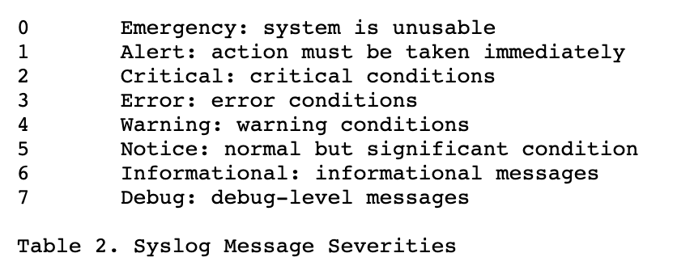
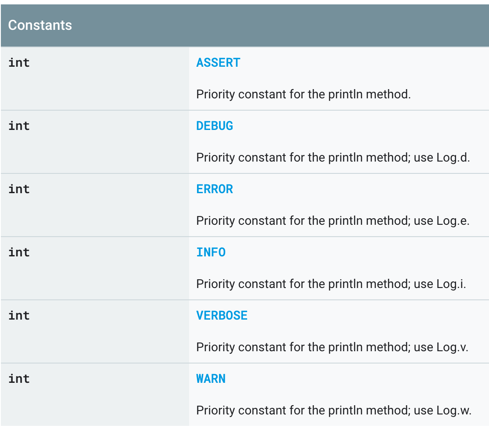

### 소개

javascript의 logger의 개념과 사용을 간략하게 소개합니다.

**개념설명**

javascript 개발 환경에서 특히 client개발을 하는경우 console.log을 보통 사용하기 때문에, 다른 언어나 framework에서 사용하는 별도의 logger을 도입하는 경우가 많지는 않습니다. 하지만 node와 같은 서버에서는 logger를 도입해서 사용하는것이 좀더 효율적으로 server log을 관리 할 수 있다고 생각됩니다.

logger을 도입하면 아래와 같은 이점이 있습니다.

- Log을 Level별로 관리 할 수 있습니다.
- Log을 file or stdout형태로 관리 할 수 있습니다.
- Log format을 각 프로젝트에 맞게 custtomize할 수 있습니다.
- Log을 빌드 시점 or Runtime에 on/off 할 수 있습니다.

**Log Level**

로그 레벨이 javascipt에서는 표준처럼 정해진 부분은 없습니다. 다만 unix system의 syslog의 RFC5424형태나 android, apach(log4j)등을 참고해 볼 수 있습니다.

syslog ([RFC5424](https://tools.ietf.org/html/rfc5424))



android



log4j


중요한 점은 Log을 Level로 구분하고, 의미를 부여하여서 관리 & 적용한다는 부분입니다. 보통 Error, Debug, Warning, Info는 거의 비슷하게(비슷한 의미로) 존재합니다.

### winston

java(apach)의 경우 log4j라는 유명한 logger라이브러리가 있습니다. javascript의 경우 javascript을 대표하는 logger라이브러리는 없지만, javascript진영에서 가장 많이 사용하는 (Top10)라이브러리중 하나인 winston을 소개합니다.

참고: [https://github.com/winstonjs/winston](https://github.com/winstonjs/winston)

**winston의 특징은 다음과 같습니다.**

- javascript logger.
- log level 컨트롤이 가능합니다.
    - custom log level정의가 가능합니다.
    - log level에 따른 동적 처리가 가능합니다.
- Transport기능을 제공합니다.
    - log을 file, db 등으로 출력하는게 가능합니다. 물론 stdout(console.log)도 가능합니다.
    - log의 출력을 level별로 조정 하는게 가능합니다.
    - 참고: [https://github.com/winstonjs/winston#transports](https://github.com/winstonjs/winston#transports)
- Format 기능을 제공합니다.
    - Custom한 format을 생성할 수 있습니다.
    - 참고: [https://github.com/winstonjs/logform](https://github.com/winstonjs/logform)
- Profile 기능을 제공합니다.
    - 간략한 수준 (수행시간 측정)에 활용 가능한 profile기능을 제공합니다.
    - 참고: [https://github.com/winstonjs/winston#profiling](https://github.com/winstonjs/winston#profiling)
- Querying Logs 기능을 제공합니다.

**winston custom logger**

아래 코드 예제처럼 사용자 입맛에 맞는 형태로 logger구성을 하여 사용하는것이 가능합니다.

- Code

    ```jsx
    import { Logger } from 'winston';
    import * as winston from 'winston';

    const { combine, timestamp, colorize, printf, json } = winston.format;

    const customFormat: any = printf((info: any) => {
      return `[${info.timestamp}][${info.level}] ${info.message}`;
    });

    // NOTE: Log only less than or equal to this level (log level)
    // LOG_LEVEL is setting when webpack build time
    const customLogger: Logger = winston.createLogger({
      level: 'LOG_LEVEL',
      levels: {
        log: 0, // log always displayed
        error: 1,
        warn: 2,
        info: 3,
        debug: 4,
      },
      format: combine(
        timestamp({
          format: 'YYYY-MM-DD HH:mm:ss.SSS',
        }),
        colorize(),
        json(),
        customFormat,
      ),
      transports: [
        new winston.transports.Console({
          level: 'LOG_LEVEL',
        }),
      ],
    });
    winston.addColors({
      log: 'grey',
      error: 'red',
      warn: 'yellow',
      info: 'green',
      debug: 'blue',
    });

    const formatObject: Function = (param: any): string => {
      const type: any = typeof param;

      if (type === 'object' || type === 'function') {
        try {
          return JSON.stringify(param, null, 2);
        } catch (e) {
          const cache: Set<any> = new Set();
          return JSON.stringify(
            param,
            (key, value) => {
              if (typeof value === 'object' && value !== null) {
                if (cache.has(value)) {
                  // Circular reference found
                  try {
                    // If this value does not reference a parent it can be deduped
                    return JSON.parse(JSON.stringify(value));
                  } catch (err) {
                    // discard key if value cannot be deduped
                    return '';
                  }
                }
                // Store value in our set
                cache.add(value);
              }
              return value;
            },
            2,
          );
        }
      }
      return param;
    };

    const createLogContent: Function = (...args: any[]): string => {
      let data = '';
      if (args.length === 1) {
        return args[0];
      }
      if (args.length > 1) {
        args.forEach((logData: any, index: number) => {
          if (index === 0) {
            data += formatObject(logData);
            return;
          }
          data += `, ${formatObject(logData)}`;
        });
      }

      return data;
    };

    // support multiple arguments e.g) logger.debug('arg1', 'arg2', 'arg3')
    const logger: any = {
      log: async (...args: any[]) => {
        customLogger.log('log', createLogContent(...args));
      },
      error: async (...args: any[]) => {
        customLogger.error(createLogContent(...args));
        // TODO: implements sen nelo log
      },
      warn: async (...args: any[]) => {
        customLogger.warn(createLogContent(...args));
      },
      info: async (...args: any[]) => {
        customLogger.info(createLogContent(...args));
      },
      debug: async (...args: any[]) => {
        customLogger.debug(createLogContent(...args));
      },
    };

    if (process.env.NODE_ENV !== 'production') {
      logger.debug('Logging initialized at debug level');
    }

    export default logger;
    ```