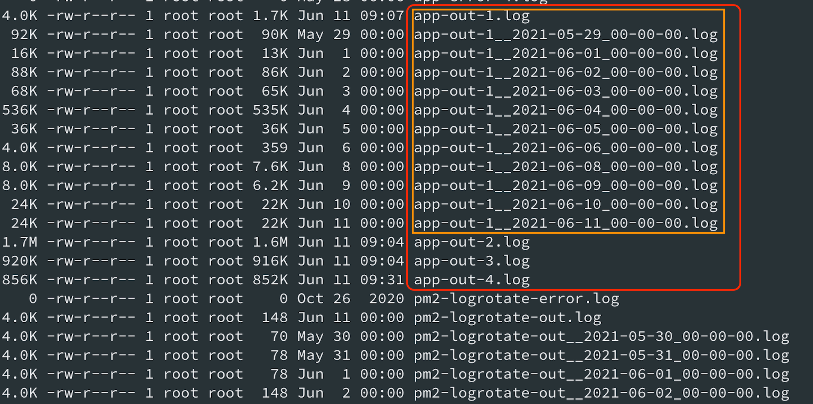

# pm2 logroate 가 pm2 멀티 인스턴스에서 이상동작

문제점



- pm2의 2.7.0 버전에서, multiple instance사용시, 첫번째 instance만 roate되는 문제
  - 위 그림을 보면 ```app-out-1.log, app-out-2.log, app-out-3.log, app-out-4.log```로 4개의 로그가 instance마다 각각 생성되는데, logroate는 ```app-out-1.log``` (첫번째 instance의 log)만 되는 문제가 있음을 알 수 있다.
- 이미 공식 이슈로 이슈업 되어 있다.
  - 관련이슈: [https://github.com/keymetrics/pm2-logrotate/issues/143](https://github.com/keymetrics/pm2-logrotate/issues/143)
- 해결 방법 요약
```
  A. pm2을 일시적으로 downgrade(2.7.0 -> 2.6.0) 하면 정상 동작한다.
  B. pm2는 multiple instance로 사용해도, log는 하나로 쌓게 한다.
```

위 두가지 방법중 하나를 사용하여 해결 가능하다.


# pm2에서 multiple instance를 사용해도 Log는 하나로 합치기
- pm2.config.js 파일에 아래와 같이 `merge_logs: true,`을 추가한다.

```javascript
module.exports = {
  apps: [
    {
      name: 'app',
      script: './dist/index.js',
      instances: 4,
      merge_logs: true,  // !!!! 이렇게 추가!!!
      exec_mode: 'cluster',
      wait_ready: true,
      listen_timeout: 60000,
      max_memory_restart: '1024M',
      kill_timeout: 5000,
    },
  ],
};

```


# pm2-logroate conf설정 방법
- 추가로 아래와 같이, pm2-logroate 설정도 가능하다.

```
$ pm2 set pm2-logrotate:compress true
$ pm2 set pm2-logrotate:retain 5
$ pm2 set pm2-logrotate:rotateInterval 0 0 * * *
$ pm2 set pm2-logrotate:max_size 500M
$ pm2 set pm2-logrotate:rotateModule true
$ pm2 set pm2-logrotate:dateFormat YYYY-MM-DD_HH-mm-ss
$ pm2 set pm2-logrotate:workerInterval 30

```

- pm2-logrotate:compress, logroate된 파일을 압축(gzip) 한다.
- pm2-logrotate:retain, rotation된 파일은 5개만 유지한다. (즉 5일치만 유지)
- pm2-logrotate:rotateInterval 0 0 * * *, -> 매일 0 시 0분에 한번 cronjob 형태 (결국 매일 1번!!!) 로 roatation을 발생한다
  - 이는 cronjob의 설정와 동일하다
- pm2-logrotate:max_size 500M, Max 500M까지만 log파일을 유지한다.
- pm2-logrotate:dateFormat YYYY-MM-DD_HH-mm-ss, logroate하는 파일의 파일명의 prefix의 dateFormat설정
- pm2-logrotate:workerInterval 30, logroate하는 checke주기로, 위 max-size에 대한 체크를 한다. 단위는 sec(초)이다. 즉 30이면 30초
