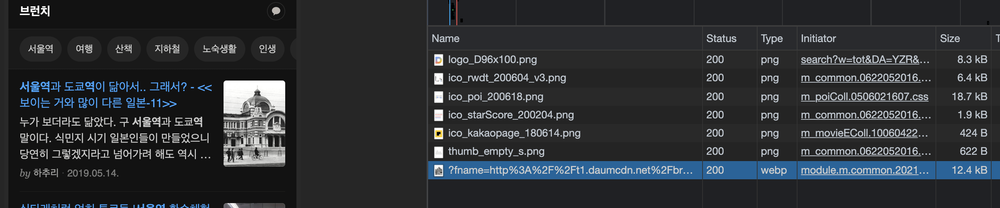
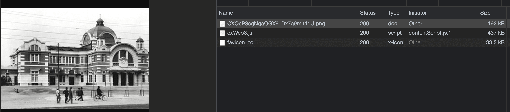
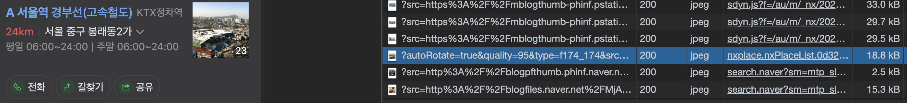
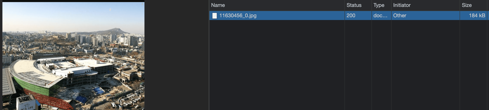
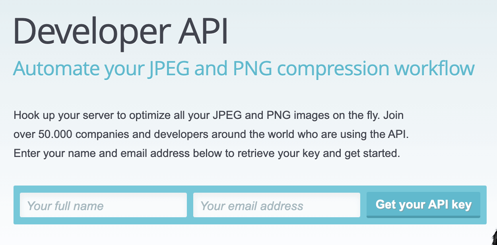
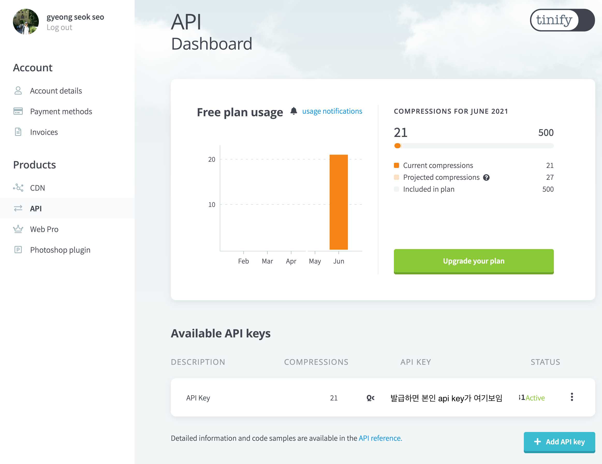
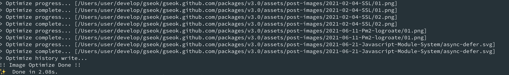

### 소개

web환경에서 resource의 용량은 성능에 매우 큰 영향을 준다. 따라서 여러가지 기법을 이용해서 이를 해결하게 된다. 이런 기법에는 splite image사용, resource cache, device rosolution에 따른 resource 서빙, image crop, image reszie 등등이 있다. 실제 매우 많은 사람이 사용하는 포털 서비스에서도 이러한 기법을 사용한다.

**실제 포털에서의 예(다음카카오)**




- 실제 서비스되는 이미지의 용량: 12.4kB
- 주소:
  - [https://search1.daumcdn.net/thumb/C200x278.fwebp.q85/?fname=http%3A%2F%2Ft1.daumcdn.net%2Fbrunch%2Fservice%2Fuser%2F3jtQ%2Fimage%2FCXQeP3cgNqaOGX9_Dx7a9mlt41U.png](https://search1.daumcdn.net/thumb/C200x278.fwebp.q85/?fname=http%3A%2F%2Ft1.daumcdn.net%2Fbrunch%2Fservice%2Fuser%2F3jtQ%2Fimage%2FCXQeP3cgNqaOGX9_Dx7a9mlt41U.png)
- 주소를 잘 보면 여러 정보를 볼 수 있다
    - ```200x278```크기로 crop
    - quality: 85%
    - 원본 이미지 주소: [http://t1.daumcdn.net/brunch/service/user/3jtQ/image/CXQeP3cgNqaOGX9_Dx7a9mlt41U.png](http://t1.daumcdn.net/brunch/service/user/3jtQ/image/CXQeP3cgNqaOGX9_Dx7a9mlt41U.png)
    - 실제 원본 이미지의 경우 아래와 같이 192kB 임을 볼 수 있다.

    


- 정리하면, 원본 192kB → 이미지 최적화 + 이미지 crop → 12.kB로 사용됨을 알 수 있다.

실제 포털에서의 예(네이버)



- 실제 서비스되는 이미지의 용량: 18.8kB
- 주소:
  - [https://search.pstatic.net/common/?autoRotate=true&quality=95&type=f174_174&src=https%3A%2F%2Fldb-phinf.pstatic.net%2F20150831_267%2F1441008970338JWBLo_JPEG%2F11630456_0.jpg](https://search.pstatic.net/common/?autoRotate=true&quality=95&type=f174_174&src=https%3A%2F%2Fldb-phinf.pstatic.net%2F20150831_267%2F1441008970338JWBLo_JPEG%2F11630456_0.jpg)
- 주소로 알 수 있는 정보
    - ```174_174``` 크기로 crop
    - quality: 95%
    - 원본 이미지 주소: [https://ldb-phinf.pstatic.net/20150831_267/1441008970338JWBLo_JPEG/11630456_0.jpg](https://ldb-phinf.pstatic.net/20150831_267/1441008970338JWBLo_JPEG/11630456_0.jpg)
    - 실제 원본 이미지의 경우 아래와 같이 184kB임을 볼 수 있다.

    

- 정리하면, 원본 184kB → 이미지 최적화 + 이미지 crop → 18.8kB로 사용됨을 알 수 있다.

대형 포탈이 아닌 개인이 서비스(블로그 등) 할때, 위의 예와 같은 처리를 하려면, 이미지 캐시 서버 혹은 이미지 처리 서버를 직접 구현하여야 한다. 하지만 개인 서비스에서 이런 추가 서비스를 별개로 구현하기는 쉽지 않다. 따라서 이러한 이미지 처리 서버 서비스를 이용해야한다. 본 글에서는, 이러한 이미지 최적화 처리를 개인이 쉽게 할 수 있는, [TinyPNG](https://tinypng.com/) 서비스를 소개한다.

### TinyPNG


- 앞선 소개에서 이야기한 기능을 제공하는 서비스이다.
- 기본적으로 web상에서 drag and drop 으로 쉽게 이미지를 최적화 할 수 있다
- 기술적으로는 png, jpg(파일의) 불필요한 meta을 제거하고, 24bit png file을 8bit indexed color형태로 변환한다고 되어 있다. (This technique is called “quantization”. By reducing the number of colors, 24-bit PNG files can be converted to much smaller 8-bit indexed color images.)

### CDN기능

- [https://tinify.com/cdn/documentation#configuration](https://tinify.com/cdn/documentation#configuration)
- web에서 직접 변환와 다르게 위 포탈의 형태와 비슷하게, image을 cdn형태로 서빙해주는 서비스 이다.
    - 맨 앞의 소개쪽의 다음, 네이버 등의 포탈이 제공하는 이미지 서버(CDN server)형태와 동일한 형태.
- 현재(2021.06) beta서비스 중이며, 해당 기능은 무료가 없고 유료만 있다.
- TinyPNG의 CDN document을 살펴보면 아래와 같이 기존 image을 tinifycdn 주소로 변환하여 사용하도록 가이드 한다.
    - 즉 이미지 자체를 TinyPNG에서 서빙해주는 형태이다.

        ```html
        **Before**
        
        
        ```

        ```html
        **After**

        
        
        ```

### API 기능

- [https://tinypng.com/developers/reference](https://tinypng.com/developers/reference)
- REST API로 image 변환 처리를 가능하게 제공하고 있다.
- 무료로 월 500건까지 사용 가능하다
- 기존적으로 ajax을 curl등으로 직접 호출도 가능하고, 여러 언어에서 사용하기 쉽게 lib도 제공하고 있다.
    - Ruby, php, Node.js, Python, Java, .Net 의 lib지원

**api auth생성**

- 당연히 api를 막쓰는건 아니고, 사용자 등록을 하여 api key을 발급 받아야 한다.
- [https://tinypng.com/developers](https://tinypng.com/developers)  페이지에서 e-mail로 인증하면 개발자 계정 로그인이 가능하다.



- 로그인 이후 [https://tinify.com/dashboard/api](https://tinify.com/dashboard/api)  로 접속하면 본인의 Dashboard로 접근 가능하다.
- 해당 Dashboard 에서 'Add api key'을 통해서 api key을 발급 받을 수 있다.



**Api 사용**

- HTTP(Rest Api)도 있기 때문에 ajax로 호출해서 사용하거나, 제공되는 lib의 형태로 사용하면 된다.
- node.js의 예

    ```bash
    npm install --save tinify
    혹은
    yarn add -D tinyify
    ```

    ```jsx
    const tinify = require("tinify");
    tinify.key = "YOUR_API_KEY";

    // auth 체크
    const check = async () => {
      return new Promise((resolve, reject) => {
    	  tinify.validate(function(err) {
    		  if (err) {
            reject(err); // Validation of API key failed.
            return;
          }

    		  // validate 이후 compression count을 알 수 있다.
    		  // 무료 500 이하로 사용하고 싶을때 해당값을 check해서 사용 가능하다.
    			let compressionsThisMonth = tinify.compressionCount;
          resolve();
    		})
      });
    }

    // optimize (compress)
    // srcPath: 소스 이미지 path
    // targetPath: 타켓 이미지 path
    // local에서 구동시 소스와 타겟 위치가 같으면 소스가 compress되서 덮어써진다.
    const compress = async (srcPath, targetPath) => {
      const source = tinify.fromFile(srcPath); // fromFile이 tinyPNG의 Source클래스를 리턴한다.
      return source.toFile(targetPath); // source.toFile은 Promise을 리턴한다.
    }
    ```

그외 [https://tinypng.com/analyzer](https://tinypng.com/analyzer) 에서 코드(이미지) 분석이나, photoshop plugin도 제공되고 있다.

### 활용

- 개인적으로는, jekyll을 통한 blog post을 할때, image source을 optimization(compress)하는 간단한 node 코드를 작성해서 사용중이다.
- 월 500회 제약이 있어서, 한번 줄인 이미지는 다시 줄이지 않도록 하는 처리를 간략하게 파일로 사용하고 있다
- 코드(image-optimize.js)

    ```jsx
    #!/usr/bin/env node

    const fs = require('fs');
    const path = require('path');
    const tinify = require('tinify');

    const prevListPath = path.resolve(__dirname, '.optimizelist');
    const { log, error } = console;
    const exit = (code = 0, fn) => {
      (fn && fn()) || process.exit(code);
    }

    const checkTargetArgs = async () => {
      const targetArgs = process.argv.slice(2);
      if (!targetArgs || targetArgs.length === 0) {
        const msg1 = `> Error: There are no target path !!!`;
        const msg2 = `> Error: Plz pass the target path 'node image-optimize.js {:targetPath}'`;
        return Promise.reject(`${msg1}\n${msg2}`);
      }

      log(`> Check targets: ${targetArgs}`);
      tinify.mytarget = [...targetArgs];
      return Promise.resolve(tinify.mytarget);
    }

    const checkAPIKey = async () => {
      const { TINYPNG_API_TOKEN } = process.env;

      log(`> Check tinypng api key: ${TINYPNG_API_TOKEN}`);
      return new Promise((resolve, reject) => {
        if (!TINYPNG_API_TOKEN) {
          const msg1 = `> Error: There are no TINYPNG_API_TOKEN !!!`;
          const msg2 = `> Error: Plz check 'export TINYPNG_API_TOKEN={:tinypng api token}' in your .bashrc or .zshrc`;
          return reject(`${msg1}\n${msg2}`);
        }

        tinify.key = TINYPNG_API_TOKEN;
        tinify.validate((err) => {
          if (err) {
            return reject(err);
          }
          return resolve(tinify.compressionCount);
        });
      });
    }

    const createTargetFilePathList = (source, list = []) => {
      if (!fs.existsSync(source)) return list;

      if (fs.lstatSync(source).isDirectory()) {
        const files = fs.readdirSync(source);
        const q = [...files].reduce((acc, curfile) => {
          const curSource = path.join(source, curfile);
          return createTargetFilePathList(curSource, acc);
        }, []);
        return [...list, ...q];
      }
      return [...list, source];
    }

    const getPrevOptimizeList = async () => {
      const text = fs.readFileSync(prevListPath, {encoding:'utf8', flag:'r'});
      const list = JSON.parse(text).data || [];
      return Promise.resolve(list);
    }

    const setPrevOptimizeList = async (list) => {
      log('> Optimize history write...')
      return new Promise((resolve) => {
        const text = JSON.stringify({ data: list }, null , 2);
        fs.writeFile(prevListPath, text, {encoding:'utf8', flag:'w'}, (err) => {
          if (err) {
            return reject(`> Error: Optimize history write !!!`);
          };
          resolve(list);
        });
      });
    }

    const getTargetPathList = async (targetArgs) => {
      const paths = targetArgs.reduce((list, targetArg) => {
        return createTargetFilePathList(targetArg, list);
      }, []);
      const prevPaths = [...await getPrevOptimizeList()];
      const filteredList = paths.filter((p) => {
        return prevPaths.indexOf(p) === -1;
      });
      return Promise.resolve({ targetPathList: filteredList, prevList: prevPaths });
    }

    const compressFile = async (source) => {
      // png, jpg 만된다
      const ext = path.parse(source).ext.toLowerCase();
      if (ext === '.png' || ext === '.jpg' || ext === '.jpeg') {
        const src = tinify.fromFile(source);
        return src.toFile(source).then(() => source);
      }

      // 그외 확장자는 그대로 pass
      return Promise.resolve(source);
    }

    const compress = async ({ targetPathList, prevList }) => {
      for (const source of targetPathList) {
        log(`> Optimize progress... [${source}]`);
        const complete = await compressFile(source);
        prevList.push(complete);
        log(`> Optimize complete... [${complete}]`);
      }
      return Promise.resolve(prevList);
    }

    // run
    (async () => {
      log('!! Image Optimize Run !!');
      checkAPIKey()
        .then(checkTargetArgs)
        .then(getTargetPathList)
        .then(compress)
        .then(setPrevOptimizeList)
        .then(() => log('!! Image Optimize Done !!'))
        .catch((msg) => {
          return exit(-1, () => {
            error(msg);
            error(`!! Image Optimize Failure  !!`);
          });
        });
    })();
    ```

    **실제 구동**

    node image-optimize.js {:targetPath} 형태로 사용중이다.

    

    ## 정리

    - 이미지 최적화는 서비스 품질와 성능을 높인다.
    - 실제 포탈등에서는 여러 기법으로 이미지 최적화를 하여 서비스 한다.
    - 개인이 직접 이미지 최적화 서비스를 구현하기 힘들수 있는데 무료로 사용가능한 tinyPNG가 있다.
    - REST API나 대중적인 언어의 lib도 제공되고 있다.
    - 해당 방법을 응용하면 본인의 서비스의 image 서비스를 최적화하여, 서비스의 품질을 높일 수 있다!!
    - 꼭 해당 서비스가 아니여도, 실제 서비스 전에 resource최적화(e.g. java의 image 최적화 lib을 쓴다던가.... 하는등의 작업)는 꼭 해주는게 좋을듯 하다.!


```toc

```
