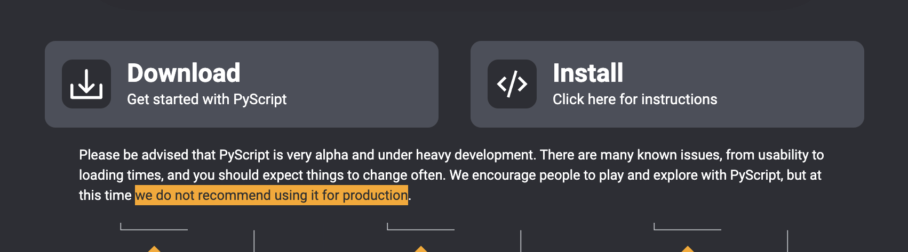
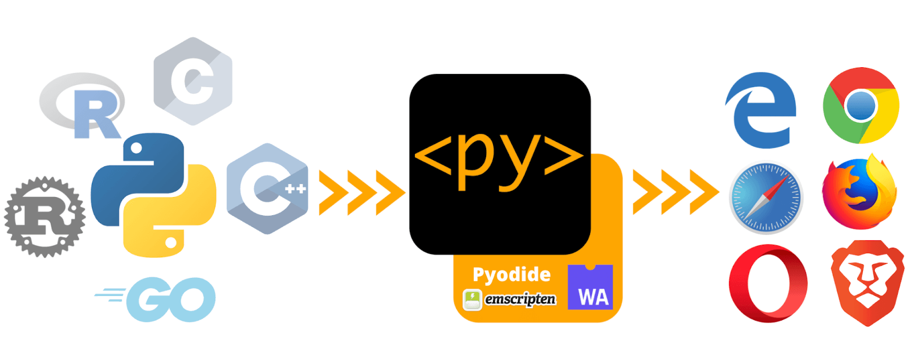
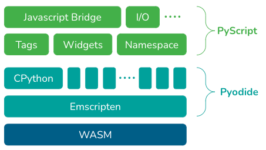
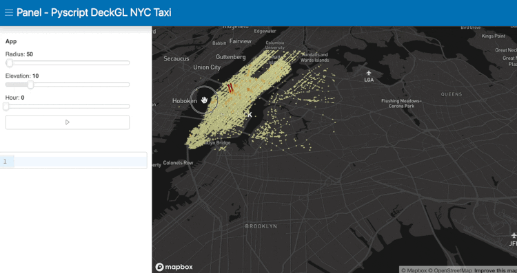

### 소개

python을 html에서 구동하게 해주는, PyScript에 대하여 간략하게 알아봅니다.

### PyScript 란?

- python을 html에서 그대로 구동하게 하는것, 즉 javascript처럼 구동 가능하다.
- [PyCon US (2022-04-27 ~ 2022-05-03) 에서, 발표](https://realpython.com/python-news-april-2022/#pycon-us-2022)(alpha 버전)되었다.
    - 현재(2022-06) 발표된 버전(alpha)이고, 공식 페이지에서도 상업용 사이트에서의 사용은 주의하라고 되어 있다.

        


### hello world

```html
<!DOCTYPE html>
<html lang="en">
  <head>
    <meta charset="utf-8" />
    <meta name="viewport" content="width=device-width,initial-scale=1" />

    <title>PyScript Hello World</title>

    <link rel="icon" type="image/png" href="favicon.png" />
    <link rel="stylesheet" href="https://pyscript.net/alpha/pyscript.css" />

    <script defer src="https://pyscript.net/alpha/pyscript.js"></script>
  </head>

  <body>
    Hello world! <br>
    This is the current date and time, as computed by Python:
    <py-script>
        from datetime import datetime
        now = datetime.now()
        now.strftime("%m/%d/%Y, %H:%M:%S")
    </py-script>
  </body>
</html>
```

- ref: [https://github.com/pyscript/pyscript/blob/main/examples/hello_world.html](https://github.com/pyscript/pyscript/blob/main/examples/hello_world.html)
- 위 코드를 생성하여 실제 구동해보면, javascripg처럼 실제 구동되어서 화면에 날자가 프린트 되는걸 확인 할 수 있다.
- 코드를 분석해보면, `pyscript.js 파일을` 로드하고 있음을 알 수 있다. 해당 파일이 `py-script`을 구동하게 해준다.

<details open>
  <summary>code and result 보기</summary>

  <iframe width="100%" height="200" src="//jsfiddle.net/gseok/b76yove8/3/embedded/html,result/" allowfullscreen="allowfullscreen" allowpaymentrequest frameborder="0"></iframe>
</details>

### PyScript simple architecture

**pyscript가 나오게된 배경**

- javascript는 client언어로 시작하여, server언어(node.js)로 확장되었다.
- 그렇다면 server언어인 pyhton은 반대로 client언어(PyScript)로 확장 할 수 있지 않을까?
    - 이러한 요구(잠재적 고객들 === python을 사용하는 개발자)가 있었다.
    - **기술의 발전(사실상 webassemble 발전)으로 가능하게 됨. === PyScript**


**pyscript의 의미**

- python의 생태계(수많은 library, component 등등) 이 → web 생태계로, web생태계의 확장
- anaconda 팀에서 말하길
    - PyScript(Pyhton)을 활용하여 FE개발자가 web application을 만들수 있게 될꺼다.
    - 데이터 과학자 입장에서 html file을 이용하여, dashboard와 models을 공유하고, browser을 통해서 구동 할 수 있게 한다.



Figuare 1. PyScript overview (ref: [https://anaconda.cloud/api/files/de4b3735-17cf-4165-9dff-75102dbbd240](https://anaconda.cloud/api/files/de4b3735-17cf-4165-9dff-75102dbbd240))

**pyscript는 어떻게 구동되는가?**



Figure 2. PyScript Tech Stack. (ref: [https://anaconda.cloud/api/files/31ea07ba-dadc-4d18-b79e-d309328762d0](https://anaconda.cloud/api/files/31ea07ba-dadc-4d18-b79e-d309328762d0))

- [Pyodide](https://pyodide.org/en/stable/index.html) 라고 불리는 **webassembly** 로 구성된 pyton용 wasm을 통해서 구동된다.
- 즉 webassembly을 이용하여 구동된다. 따라서 각 browser vendor가 javascript engine와 같은 어떤 별도의 python engine을 browser에 가지고 있지 않아도 구동된다! (일단 현재는…)
    - 개인적으로는 만약 python 개발자의 유입이 많아지면 사실상 native(browser) 에서 직접 제공도 할 수 있다고 생각한다. (그럼 javascript + python 투트랙?!? ← 먼훗날 확인하기로)
- webassembly가 1.0을 발표(2019.12)하고, 약 2년만에 이렇게, python이 구동가능할 정도로 발전하다니 정말 놀랍다.
    - 이런식이라면, 정말로, webassermbly는 다른 언어들, 특히나 script형 function형 언어들의 porting을 기대해볼만 할듯 하다.

### PyScript Example

**pyscript의 주요 구성 요소**

- py-env: Python 코드를 실행하는데 필요한 Python 패키지를 정의한다.
    - [https://github.com/pyscript/pyscript/blob/main/examples/panel_stream.html#L38-L43](https://github.com/pyscript/pyscript/blob/main/examples/panel_stream.html#L38-L43)

    ```html
    <py-env>
        - bokeh
        - numpy
        - pandas
        - panel==0.13.1
    </py-env>
    ```

- py-script: Python 코드를 작성할수 있는 영역 태그. 혹은 Pyton 코드 file을 src로 로드하는 태그.
    - `<script>` 태그와 유사하다.
    - [https://github.com/pyscript/pyscript/blob/main/examples/panel_stream.html#L69-L115](https://github.com/pyscript/pyscript/blob/main/examples/panel_stream.html#L69-L115)

    ```html
    <!-- 아래와 같이 python 파일을 로드 하던가 -->
    <py-script src="/python_file.py"></py-script>

    <!-- 또는 아래와 같이 python코드를 작성 할 수 있다.-->
    <py-script>
    	from datetime import datetime
    	now = datetime.now()
    	now.strftime("%m/%d/%Y, %H:%M:%S")
    </py-script>
    ```

- py-repl(Read Eval Print Loop): REPL을 바로 할 수 있게 해준다.
    - [https://github.com/pyscript/pyscript/blob/main/examples/panel_deckgl.html#L70](https://github.com/pyscript/pyscript/blob/main/examples/panel_deckgl.html#L70)

    

  <details open>
    <summary>code and result 보기</summary>

    <iframe width="100%" height="300" src="//jsfiddle.net/gseok/dorpsbk7/4/embedded/html,result/" allowfullscreen="allowfullscreen" allowpaymentrequest frameborder="0"></iframe>
  </details>


**그외 핵심요소**

- **Python ecosystem:** 유명하고, 유용한 아주 많은 Python 패키지를 사용할 수 있다. (such as numpy, pandas, scikit-learn, and more)
- **Python with JavaScript:** Javascript와 Python양방향으로 객체(objects)와 namespaces에 접근하고 통신(사용) 할 수 있다.(이 부분의 deep한 기술 내용은 Pyodied의 js ↔ python간 사용 관련 문서를 참고)
- **Environment management:** 사용자가 사용하고자하는 python패키지를 정의하고 관리할 수 있다.(py-env)
- **Visual application development:** 버튼, 컨테이너, 텍스트박스 등 즉시 사용가능한 UI요소를 제공하고 있다.

### 정리

- PyScript 는 python을 on browser에서 구동하게 해준다. (PyScript brings Python to the browser.)
- Browser에서 python엔진을 제공하는건 아니고 webassembly기술을 활용하여 제공되고 있다.
- 이제 alpha version으로 시작이지만, python의 미래이자 web기술(생태계)의 확장이다. (아직 tensorflow등은 구동 안된다고 한다…)
- web(FE) 개발자라면 매우 관심있게 지켜볼 주제라고 본다.(python 도 공부해서 같이 쓰자~)

### 참고

- 공식홈페이지: [https://pyscript.net/](https://pyscript.net/)
- 아나콘다 문서: [https://anaconda.cloud/pyscript-python-in-the-browser](https://anaconda.cloud/pyscript-python-in-the-browser)
- Getting Started: [https://github.com/pyscript/pyscript/blob/main/docs/tutorials/getting-started.md](https://github.com/pyscript/pyscript/blob/main/docs/tutorials/getting-started.md)
- python 기사: [https://realpython.com/python-news-april-2022/](https://realpython.com/python-news-april-2022/)
- git: [https://github.com/pyscript?type=source](https://github.com/pyscript?type=source)
- examples: [https://github.com/pyscript/pyscript/tree/main/examples](https://github.com/pyscript/pyscript/tree/main/examples)
- Pyodide: [https://pyodide.org/en/stable/index.html](https://pyodide.org/en/stable/index.html)
    - js가 python사용하기: [https://pyodide.org/en/stable/usage/quickstart.html#accessing-python-scope-from-javascript](https://pyodide.org/en/stable/usage/quickstart.html#accessing-python-scope-from-javascript)
    - python이 js사용하기: [https://pyodide.org/en/stable/usage/quickstart.html#accessing-javascript-scope-from-python](https://pyodide.org/en/stable/usage/quickstart.html#accessing-javascript-scope-from-python)
- webassembly: [https://webassembly.org/](https://webassembly.org/)

```toc

```
