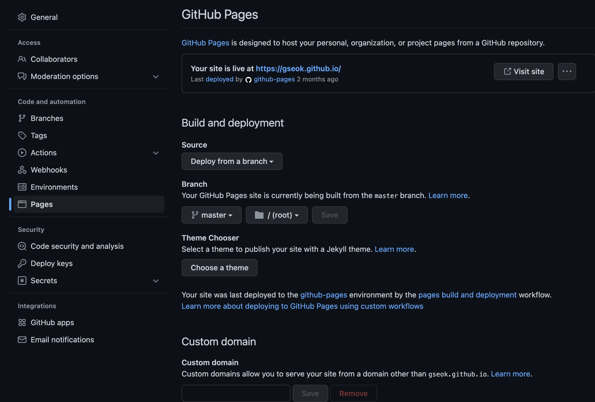
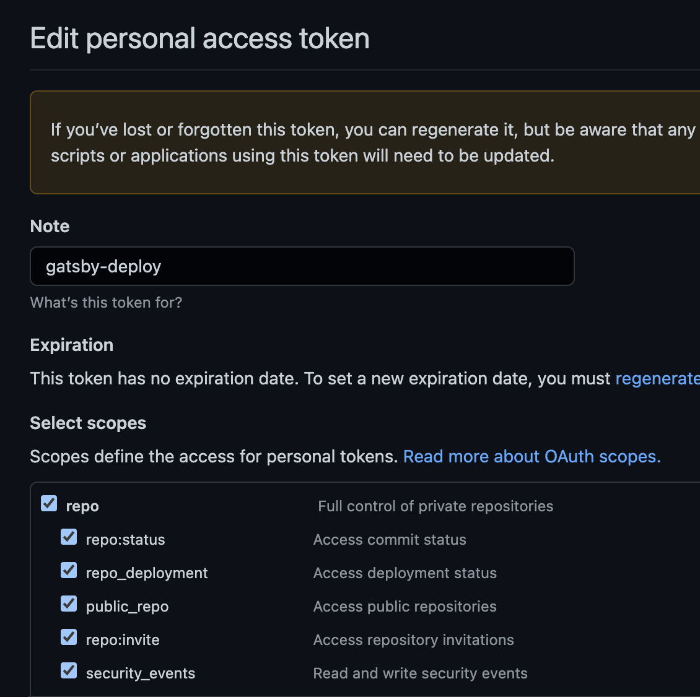
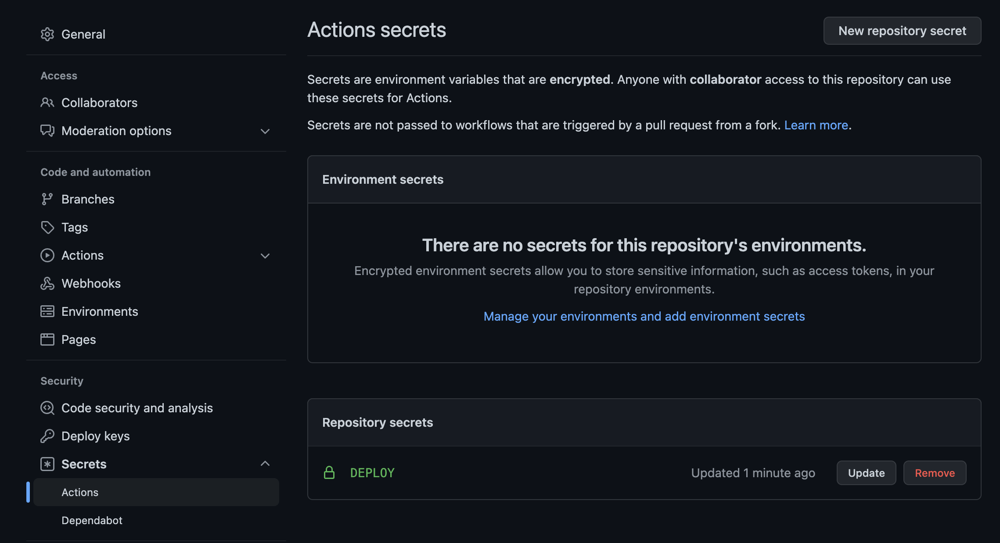
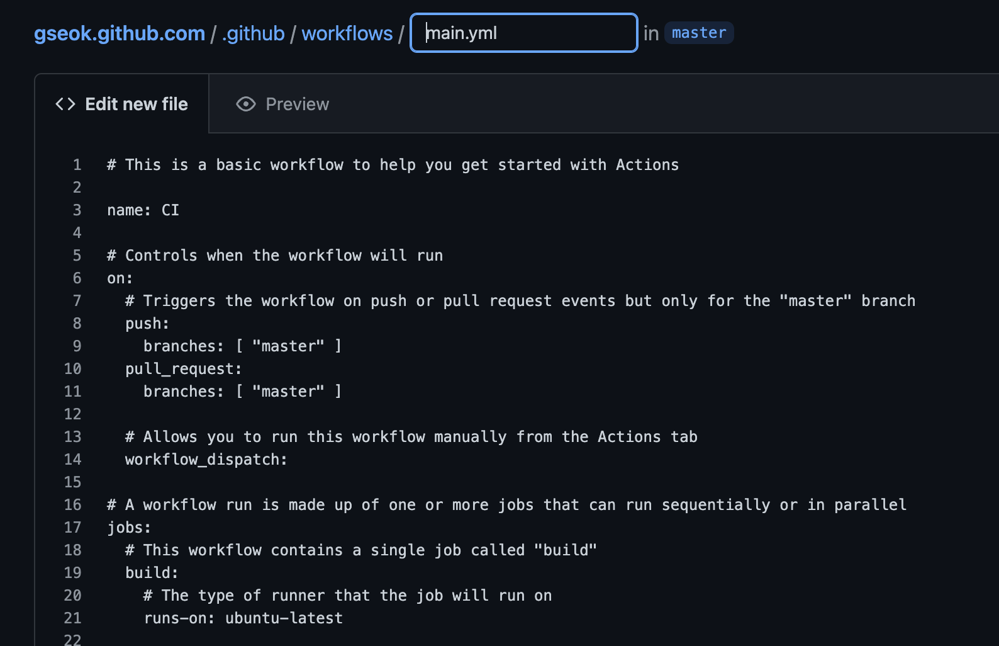
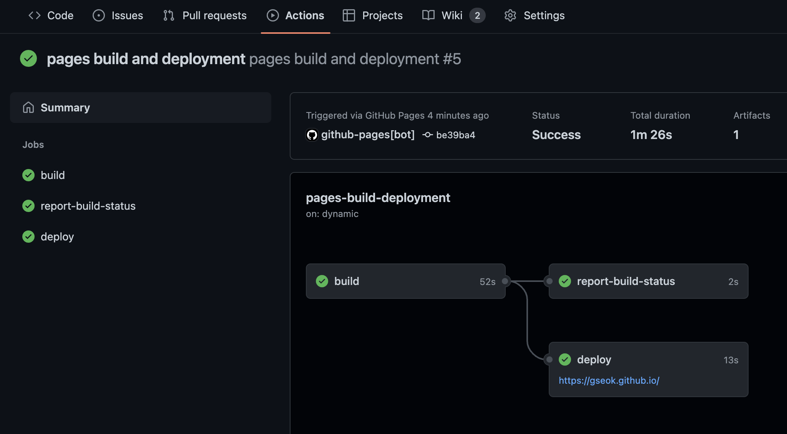

### 왜 바꾸었나요!

기존에 잘 구동되던, Jekyll 로 만들어진 블로그를 Gatsby 로 마이그레이션 하였습니다. 여러가지 이유가 있지만, 현재 주력으로 사용하고 있는 javascript fw인 react로 되어있다는 점과, build가 기존 Jekyll보다 빠르다는 소문? 을 듣고 변경을 결심하게 되었습니다.

### Gatsby 설치하고 Local에서 띄워보기

공식 사이트의 튜토리얼을 참고하여, 직접 사이트를 구축하고 띄워는 방법도 있습니다. 하지만 바퀴를 새로 발명하지 않아도 바퀴가 이미 존재하듯이, 이미 만들어져 있는 여러 블로그 테마중 하나를 사용하여 띄워 보겠습니다.

- 공식 사이트 참고([https://www.gatsbyjs.com/docs/how-to/](https://www.gatsbyjs.com/docs/how-to/))

Gatsby는 Jekyll와 마찬가지로 이미 생성된 여러가지 Theme(Gatsby Starter Lib)을 지원합니다. 사실 블로그가 아닌 static page을 쉽게 생성해주는 framework이기 때문에, 여러 종류(e.g. 개인 홈페이지, 간단한 기업 홈페이지, 쇼핑몰 사이트 등등)의 정적 페이지를 만들 수 있습니다.

- 공식 사이트에 있는 Starter Lib 참고([https://www.gatsbyjs.com/starters/?v=2](https://www.gatsbyjs.com/starters/?v=2))

저는 기존 Jekyll로 블로그를 만들었었기 때문에, 동일하게 Gasby로 블로그를 만들었습니다. 위 공식 사이트의 Stater Lib이외, 한국 개발자가 생성한 Gatsby Blog Template을 사용했습니다.

- https://github.com/zoomKoding/zoomkoding-gatsby-blog
- https://github.com/JaeYeopHan/gatsby-starter-bee

본 글에서는 zoomking 템플릿을 사용하였는데, 사실 어떤 템플릿이던 본인이 원하는 템플릿을 사용하면 됩니다. 다만, 각 템플릿의 실제 구현체에서 화면을 구성하는 형태가 각각 존재 할 수 있는데, 이때 해당 형태(각 템플릿이 가이드하는 형태)에 맞게 설정하는 부분만 잘 맞추어 주면 됩니다.

**템플릿 가져오기**

- 템플릿을 사용하려면 템플릿을 가져와야 합니다.
    - gatsby가 제공하는 cli로 생성 가능합니다.

    ```json
    $ npm install -g gatsby-cli
    # gatsby new [프로젝트이름] [테마주소]
    ```

    - 또다른 방법으로 해당 템플릿의 github 의 소스를 clone해서 가져와도 됩니다.

    ```json
    $ git clone https://github.com/zoomkoding/zoomkoding-gatsby-blog.git
    ```


**가져온 템플릿(코드)를 빌드하고, 로컬에서 실행해보기**

- 사실 코드를 들고 왔다면, 이후에는 일반적인 프로젝트를 로컬에서 수행하는것과 동일합니다.

    ```json
    $ npm install
    $ npm start
    ```

- 위 명령어 수행후 browser에서 [`http://localhost:8000/`](http://localhost:8000/) 주소를 열어서 곧바로 확인 가능합니다.

**템플릿에 post 작성하기**

- 템플릿 하위의 content 폴더 하위에 markdown(.md) 파일을 생성하여 post을 작성 할 수 있습니다.

    

- 각 md 파일의 최상단에는, Jekyll 와 비슷한 형태로, 헤더에 post정보를 meta형태로 입력 할 수 있습니다.

    ```json
    ---
    emoji: 🔮
    title: Gatsby 테마로 GitHub Blog 만들기
    date: '2021-07-06 00:00:00'
    author: 줌코딩
    tags: 블로그 github-pages gatsby
    categories: 블로그 featured
    ---
    ```

- 이후 각 post는 md(markdown) 형태로 작성하면 됩니다.

### Jekyll와 달리 편리했던점은?

- Gatsby는 node.js와 같이 javascript 기반이기 때문에 기존 javascript기반 개발환경에서 곧바로 이용 가능했습니다. 즉 언어의 통일성이 유지됩니다. javascript개발자라면 아마 여기서부터 벌써 너무 편리할꺼 같습니다.
    - Jekyll의 경우 Ruby 기반으로 Ruby 설치 및 Ruby용 package manager(`gem`) 설치가 필요 합니다.
    - 이후 Ruby을 통해서 Jekyll설치 및 Jekyll에서 사용하는 dep 설치하는 방식 입니다.
    - 물론  Gatsby도 `npm(yarn)`이 있어야하고, 해당 package manager로 dep설치가 필요하지만, 기존 javascript개발자라면 이질감 없이 곧바로 적용 가능 합니다.
- React코드를 직접 수정하여, 전체 blog을 커스터 마이징 가능합니다.

작성하고 보니, javascript개발 및 react개발 경험이 있을때 편리했던점이 되네요!

### Jekyll 에서 사용하던  post 마이그레이션 하기

Jekyll 역시 markdown형태로 각 post을 서빙하고 있었기 때문에, 해당 파일을 새롭게 제공하는 Gatsby 로 이동하는 형태로 간단하게 post을 마이그레이션 할 수 있습니다.

> 주의! - md(markdown) 파일의 헤더 영역의 spec이 다른 부분은 맞추어 주어야 합니다.
>

> 주의! - Gatsby가 캐시하는 부분이 있어서, 개발도중 정상적으로 나오지 않는 경우 아래 명령어를 통해서 캐시를 지워야 합니다.
`gatsby clean`
>

### utterances 추가하기

utterances는 블로그 포스트의 댓글달기를 github의 issue와 연동하여 제공하는 서비스 입니다. 해당 방법을 통하여 각 블로그 포스트에 댓글 달기를 지원할 수 있습니다.

공식 추가방법: [https://utteranc.es/](https://utteranc.es/)

**추가방법(zoomkoding)**

- github 레포지토리가 public이여야 합니다.
    - github private → public 참고: [https://docs.github.com/en/repositories/managing-your-repositorys-settings-and-features/managing-repository-settings/setting-repository-visibility](https://docs.github.com/en/repositories/managing-your-repositorys-settings-and-features/managing-repository-settings/setting-repository-visibility)
- utterances app(github app)을 설치합니다.
    - https://github.com/apps/utterances
- 템플릿(zoomkoding)의 config파일(gatsby-meta-config.js)에서 utterances 항목을 설정합니다.

    ```json
    comments: {
        utterances: {
          repo: ``, // `zoomkoding/zoomkoding-gatsby-blog`,
        },
      },
    ```


### google analytics tracking id  추가하기

- 구글 [애널리틱스에](https://analytics.google.com/) 접속합니다.
- 계정을 생성하고, Tracking ID을 발급받습니다.
    - 계정은 아무 이름으로 생성해도 무방합니다.
- 구글 애널리틱스 > 우하단 관리 > 누르면 우측에 ‘계정, 속성, 보기' 화면이 나옵니다.
    - 속성 부분에서 중간쯤에 `<> 추적정보 > 추적코드` 을 눌러보면 gtag에서 사용가능한 추적 ID을 알 수 있습니다.
- 해당 ID 값을 `gatsby-meta-config.js` 내부의 `ga` 속성에 넣어줍니다.

### Github gh-pages 로 배포하기

- github이 기본적으로 제공하는 static page 배포 기능을 활용하는 방법 입니다.
- 계정 + 프로젝트 별로 static한 page을 서비스 할 수 있습니다.
- 기본 컨셉은, github의 Settings 화면을 통해서 “특정 브랜치", “특정 폴더(루트)” 을 설정하여 배포합니다.

    

    - 따라서 해당 설정 이후, 로컬에서 빌드하고, 빌드 결과를 “특정 브랜치" 에 push하는 형태로도 배포가 가능합니다.
    - 하지만 매번 로컬 빌드 → 직접 특정 브랜치에 push하는게 귀찮은 경우, pr(pull request)에 따라서 자동으로 배포해주는 `github action` 을 활용하거나, local에서 쉽게 배포를 해주는(`gh-pages`) 을 활용하는것을 추천합니다.

### Github Action 사용하기

- 개인용 Token을 하나 발급 받습니다. - https://github.com/settings/tokens
    - 프로젝트 Setting 이 아닌, 사용자 계정 Setting → 좌측 하단의 Developer settings → Personal access tokens 입니다.
    - 이름은 아무거나 해도 됩니다.
    - repo 권한을 주어야 합니다.

        

        <aside>
        💡 주의! 처음 토큰이 생성되었을때 토큰값을 복사해서 가지고 있어야 합니다.

        </aside>

- 이제 프로젝트에 가서 → 프로젝트 Action용 Secrets을 저장합니다.
    - 이름은 아무거나 해도 됩니다.
    - 토큰값을 위 개인토큰으로 생성한걸 활용합니다.

        

- 이제 Action을 사용할 기반 준비가 완료되었습니다. 이제 Action을 등록합니다.
    - Action → New workflow 로 워크플로우를 새로 생성합니다.
    - 기본적으로 node.js나 Jekyll와 같은 wokflow 템플릿이 존재합니다. 우리는 gatsby을 직접 workflow생성합니다. (set up a wokflow yourself →)

        

    - 생성하면 기본 format으로 yaml파일이 하나 생성됩니다.
    - 해당 파일에 특정 브랜치에 특적 pr(pull request)가 왔을대, 특정 동작(jobs)을 생성 할 수 있습니다.

        ```yaml
        # This is a basic workflow to help you get started with Actions

        name: Gatsby Deploy

        # Controls when the workflow will run
        on:
          # Triggers the workflow on push or pull request events but only for the "master" branch
          push:
            branches: [ "master" ]
          pull_request:
            branches: [ "master" ]

          # Allows you to run this workflow manually from the Actions tab
          workflow_dispatch:

        # A workflow run is made up of one or more jobs that can run sequentially or in parallel
        jobs:
          # This workflow contains a single job called "build"
          build:
            # The type of runner that the job will run on
            runs-on: ubuntu-latest

            # Steps represent a sequence of tasks that will be executed as part of the job
            steps:
              # Checks-out your repository under $GITHUB_WORKSPACE, so your job can access it
              - uses: actions/checkout@v3
              # build and deploy
              - uses: enriikke/gatsby-gh-pages-action@v2
                with:
                  access-token: ${{ secrets.DEPLOY }}
                  deploy-branch: gh-pages
                  skip-publish: false
        ```

        - https://github.com/enriikke/gatsby-gh-pages-action 에 생성된 action을 활용합니다.
        - `secrets.DEPLOY` 부분에, action용 secret 생성시 사용한 이름을 활용합니다.
        - 정상 구동시 아래와 같이 빌드 및 배포 결과를 볼 수 있습니다.

            


<aside>
💡 주의! `.github/workflows/main.yml` 파일은, 해당 workflow가 구동되어질 branch에 있어야 합니다.
즉 develop에서 작업해서 master(혹은 gh-pages)로 deploy하는식으로 구성했다면 develop 브랜치에 해당 파일(`.github/workflows/main.yml`)이 있어야 합니다.

</aside>

### Netlify로 배포하기

- **[https://netlify.com](https://app.netlify.com/sites/hislogs/settings/deploys) 에 접속합니다.**
- SSO로 로그인(가입) 가능한데, github연동하여 빌드할때 어차피  github연동이 필요하기 때문에 github으로 가입합니다.
- 로컬 개발환경에 netify-cli 을 dev-dependency로 추가하거나, global로 설치합니다.

    ```json
    $ yarn add -D netlify-cli

    또는

    $ yarn global add netlify-cli
    ```

- netlify.toml 파일을 생성합니다. 프로젝트 루트 위치에 생성합니다.
    - 현재 사용중인  Gatsby 템플릿은 이미 해당 파일이 존재합니다.
    - 다른 템플릿을 쓰거나, 꼭 Gatsby 프로젝트가 아니여도, netilfy.toml을 생성하여 관리 가능합니다.

    ```json
    [build]
      publish = "public"
      command = "npm run build"
    [build.environment]
      NODE_VERSION = "16"
      NPM_VERSION = "8.12.1"
    ```

    - 설정은 매우 직관적입니다. publish 하려는 디렉토리와, 해당 디렉토리를 만들어내는 빌드 명령어를 명시합니다.
    - 해당 빌드 명령어가 구동될 node 및 npm 환경을 명시합니다.

> 주의! 이전 heroku와 같이 netlify에 배포하면 https://{your-site-name}.netlify.app 에 배포됩니다.
따라서 github.io을 사용하고 싶은 경우에는, Github의 gh-page에 배포해야합니다.
>

<aside>
💡 github.io에 배포하던, netlify.app 에 배포를 하던, 본인만의 DNS을 사용하는경우, 해당 DNS을 연결하면 하나의 URL(DNS)로 사용이 가능합니다.

</aside>

### 참고

- 공식 사이트 - [https://www.gatsbyjs.com/docs/how-to/](https://www.gatsbyjs.com/docs/how-to/)
- gatsby로 블로그 만들기 post들
    - [https://hislogs.com/make-gatsby-blog/](https://hislogs.com/make-gatsby-blog/)
    - [https://velog.io/@gparkkii/build-gatsby-blog](https://velog.io/@gparkkii/build-gatsby-blog)
- utterances - [https://utteranc.es/](https://utteranc.es/)

```toc

```
