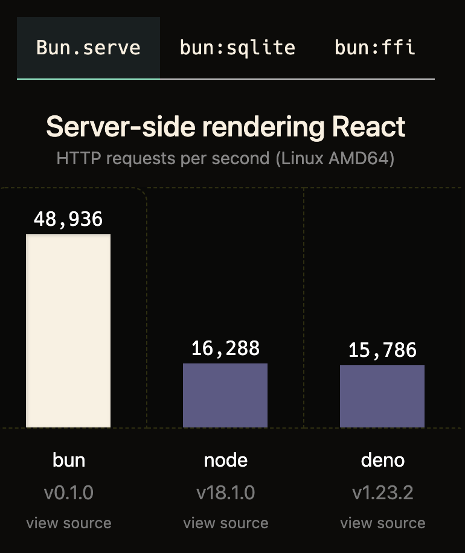

### 소개

최근 javascript생태계에서, 매우 hot 하다는 Bun 이라는 기술?을 간략하게 살펴봅니다.

현재 2022-08-15 기준으로 나온지 얼마 안되었습니다. Bun은 2022년 7월 초에 베타로 처음 공개되었다고 합니다. 정확한 발표일을 찾지 못하였는데, 2022.07 이전에 웹상에 블로그글 등이 없는것으로 보아 맞는듯 합니다. 해외 블로그 등에서 나름 hot하게 다루어지는거 같습니다.

2022-08-15 기준 - Bun v0.1.8 인 상태에서 작성하여, 이후 버전에서는 내용이 본 글과 다를 수 있습니다.

### Bun이란?

> **`Bun is a fast all-in-one JavaScript runtime`**
>

Bun은 매우 빠른 **자바스크립트 런타입(Javascript Runtim)** 입니다. 추가로 Javascript runtime만 제공하는게 아니라. 번들러(Bundle), 트랜스파일러(transpile), 패키지 매니저, Typescript기본제공 등과 같은 여러 부가기능을 기본제공합니다. Bun에서는 이를 all-in-one javascript runtime이라고 지칭합니다.

- **어찌되었건 Node나 Deno와 같은 Javascript runtime 입니다!!!**

### Bun특징

Bun공식 문서상 내용으로, 매우 빠르고, [Node-API](https://nodejs.org/api/n-api.html)의 90% 호환이 되고 있다고 합니다. 이는 Deno와 다르게 node를 그대로(drop-in replacement) 호환시켜 성능향상을 할 수 있다고 합니다.

**Bun의 철학**

- 빠르게 시작 가능 - Start fast (it has the edge in mind).
- 새로운 레벨의 성능 - New levels of performance (extending JavaScriptCore, the engine).
- 편리하게 툴 모두 제공 - Being a great and complete tool (bundler, transpiler, package manager).

**Bun의 목표**

- node혹은 deno랑 비슷한데, 브라우저(browser)이외 환경에서 javascript을 제공하고, 개발자 생산성을 극대화 해주겠다!

### Bun이 기본 내장하는것

- Web API - [fetch](https://developer.mozilla.org/en-US/docs/Web/API/fetch), [WebSocket](https://developer.mozilla.org/en-US/docs/Web/API/WebSocket), [ReadableStream](https://developer.mozilla.org/en-US/docs/Web/API/ReadableStream)
- node_modules
    - node.js의 module resolution 알고리즘 그대로 차용, npm package을 Bun에서 사용 가능하고, ESM(Bun 내부 기본), CJS(CommonJS)지원된다.
    - node.js 하위호환을 하려는게 보이는 대목
- Bun.Transpiler
    - Typescript, ‘<JSX>’ - Bun내에서 file이 기본적으로 transpiled된다고한다
    - 트랜스파일러를 API형태로도 사용가능 (Bun.Transpiler)
- Bun.Write
    - system call이 빠르다. 특히 파일 관련 api들!(write, copy, pipe, send, clone)
- .env
    - 기본적으로 .env을 제공하여, `require("dotenv").config()` 가 필요없다.
- bun:sqlite
    - SQLite3 client을 빌트인 으로 들고 있다.
- Node-API - node native module 90%제공(Bun메인 홈피 주장에 따르면 90%)
- bun:ffi(Foreign Function Interface)
- node호환?
    - node:fs, node:path 와 같이 node.js에서 제공되던걸 제공?

### Bun 내부구현은?

- [webkit(JavascriptCore)](https://github.com/WebKit/WebKit/tree/main/Source/JavaScriptCore)을 javascript engine으로 가진다.
    - 당연히 javascript runtime이니 가져야겠지!
    - v8보다 빠르다. - [https://twitter.com/jarredsumner/status/1499225725492076544](https://twitter.com/jarredsumner/status/1499225725492076544)
- Bun은 **[ZIG](https://ziglang.org/)언어**로 구현되어 있다.
    - 2022-08-15기준으로 ZIG는 0.9.1 버전이다.
    - 참고로 **Deno는 [Rust](https://www.rust-lang.org/)**(22.08-15기준 - 1.63.0)로 구현되어 있다.
- Bun이 빠른 이유 자체가 ZIG언어의 특징(low level memory관리 및 simple한 control flow)에 있다고 한다.

### Bun 간략한 사용법

**설치하기([install 스크립트](https://bun.sh/install))**

```jsx
curl https://bun.sh/install | bash
```

**Bun의 HTTP 서버는  [Request](https://developer.mozilla.org/en-US/docs/Web/API/Request) and [Response](https://developer.mozilla.org/en-US/docs/Web/API/Response) 객체를 내장하고 있음**

```jsx
// http.js
export default {
  port: 3000,
  fetch(request) {
    return new Response("Welcome to Bun!");
  },
};
```

**Bun 실행**

```bash
$ bun run http.js
```

브라우저에서 http://localhost:3000 으로 접속해서 확인(”Welcom to Bun!”)가능.

**기타 `bun create`으로 프로젝트 제공하는 부분**

Create a new Next.js project:

```bash
bun create next ./app
```

Create a new React project:

```bash
bun create react ./app
```

Create from a GitHub repo:

```bash
bun create ahfarmer/calculator ./app
```

To see a list of examples, run:

```bash
bun create
```

**그외**

- 예제 - [more examples](https://github.com/oven-sh/bun/tree/main/examples)
- 문서 - [docs](https://github.com/oven-sh/bun#Reference)
- 문의사항(Discord로 되어있다) - [Bun's Discord](https://bun.sh/discord).

### Bun 벤치마크

**개발자에게 필살 현혹기**로 작용하는  벤치마크!!!, 항상 그렇듯 각각의 프로젝트는 자신의 프로젝트가 가장 좋다고 하기 때문에, 벤치마크용 테스트 코드 등을 잘 살펴서, 냉정하게 봐야한다.!!!


[https://bun.sh/](https://bun.sh/)

실제 DB에 얼마만큼의 데이터가 있고 복잡도가 있는지 모르겠지만, 아주 Simple한 Select쿼리 상으로 3배 정도의 성능이 좋다고 한다.

- Bun.js 벤치마크 테스트 코드
    - [https://github.com/oven-sh/bun/blob/e55d6eed2bf9a5db30250fdd8b9be063dc949054/bench/sqlite/bun.js](https://github.com/oven-sh/bun/blob/e55d6eed2bf9a5db30250fdd8b9be063dc949054/bench/sqlite/bun.js)
- Node.js 벤치마크 테스트 코드
    - [https://github.com/oven-sh/bun/blob/e55d6eed2bf9a5db30250fdd8b9be063dc949054/bench/sqlite/node.mjs](https://github.com/oven-sh/bun/blob/e55d6eed2bf9a5db30250fdd8b9be063dc949054/bench/sqlite/node.mjs)
- Deno.js 벤치마크 테스트 코드
    - [https://github.com/oven-sh/bun/blob/e55d6eed2bf9a5db30250fdd8b9be063dc949054/bench/sqlite/deno.js](https://github.com/oven-sh/bun/blob/e55d6eed2bf9a5db30250fdd8b9be063dc949054/bench/sqlite/deno.js)

```bash
$ bun run bench:bun && bun run bench:node && bun run bench:deno

$ $BUN bun.js
[0.02ms] ".env"
cpu: Intel(R) Core(TM) i7-5600U CPU @ 2.60GHz
runtime: bun 0.1.4 (x64-linux)

benchmark                        time (avg)             (min … max)
-------------------------------------------------------------------
SELECT * FROM "Order"         43.62 ms/iter   (40.67 ms … 47.89 ms)
SELECT * FROM "Product"      121.84 µs/iter  (87.83 µs … 928.85 µs)
SELECT * FROM "OrderDetail"  499.15 ms/iter  (470.1 ms … 620.22 ms)

$ $NODE node.mjs
cpu: Intel(R) Core(TM) i7-5600U CPU @ 2.60GHz
runtime: node v18.6.0 (x64-linux)

benchmark                        time (avg)             (min … max)
-------------------------------------------------------------------
SELECT * FROM "Order"        108.33 ms/iter (106.17 ms … 113.98 ms)
SELECT * FROM "Product"       318.2 µs/iter (285.53 µs … 775.32 µs)
SELECT * FROM "OrderDetail"     2.13 s/iter       (2.02 s … 2.37 s)

$ $DENO run -A --unstable deno.js
cpu: Intel(R) Core(TM) i7-5600U CPU @ 2.60GHz
runtime: deno 1.23.4 (x86_64-unknown-linux-gnu)

benchmark                        time (avg)             (min … max)
-------------------------------------------------------------------
SELECT * FROM "Order"         274.7 ms/iter (263.29 ms … 342.62 ms)
SELECT * FROM "Product"      490.34 µs/iter   (377.47 µs … 7.49 ms)
SELECT * FROM "OrderDetail"      1.6 s/iter       (1.43 s … 2.12 s)
```

### 소감

개인적인 소감임을 먼저 밝혀 둔다.

- **nodejs호환 을 매우 신경**쓴듯.
- typescript설정, webpack와 같은 번들러, babel와 같은 transpiler등과 같은 devOps에 대한 기능을 잘 내장하려는 움직임.
- 개인적으로 잘 내장하는건 좋지만, 개발의 다양성으로 인하여, custom된 설정등이 필요할때 충돌없이 잘 되어야 할텐데 하는 걱정은 존재. (all-in-one의 함정?), (개인적으로 nx 에서 한번 크게 고생함)
    - 예를들어서…
        - 우리 프로젝트는 .env안쓰고 cross-env쓸껀데?
        - 우리 프로젝트는 esbuild 할껀데?
        - 우리 프로젝트는 webpack쓰고 multiple entry에 multiple output할껀데?
    - 사용자 custom 사용환경(devOps)에 대한 open이 어느정도까지 맞추어 줄까?
        - **`사실 Bun을 쓰되 javascript runtime만 쓰면 큰 문제는 없긴 할듯?`**
- bun:ffi을 보자마자 느낀점, node의 node-gyp의 문제점으로 → deno에서 deno:ffi을 제공하는데 많이 벤치마킹한듯!

개인적으로, 매우 hot 하다는 Bun을 (빵굽다 빨리 굽다? 느낌인가?) 재미있게 살펴보았다. 현재 Bun v0.1.8 버전으로 아직 v1.0.0도 아닌데 벌써 입소문은 퍼지고 있는거 같다.

하지만 많은 기술들이 그렇듯 실제로 떠서 대세기술(defacto)처럼 될지는 아직은 미지수 인듯 하다. webassemly가 매우 오래전(2022.08기준으로 5년전<2017.03>에 발표)에 나왔는데 이제 pyscript같은 응용기술이 나오고 있으니 말이다. bun이 정말 1~2년 내에 v1.0.0을 출시하고, 이어서 node 생태계를 먹고, deno을 이길까? 는 실제 시간이 지나봐야 알 수 있는 일이다.

따라서 개인적으로 관심있게 지켜보되, 현재 현업이라면 현업 프로젝트에 바로 적용하기는 약간 조심스러울듯 하다. 물론 개인적인 toy프로젝트에는 얼마든지 해볼 수 있을듯 하고, 현업(리얼)프로젝트의 적용은, v1.0.0가 출시된 이후 다시 고민해봐야 할듯 하다.

### 참고

- 공식
    - [https://bun.sh/](https://bun.sh/)
    - [https://github.com/oven-sh/bun#Reference](https://github.com/oven-sh/bun#Reference)
- bun을 주제로한 블로그 글 참고
    - [https://devclass.com/2022/07/06/zig-based-bun-appears-in-beta-an-incredibly-fast-all-in-one-javascript-runtime/](https://devclass.com/2022/07/06/zig-based-bun-appears-in-beta-an-incredibly-fast-all-in-one-javascript-runtime/)
    - [https://medium.com/@YNNSme/node-js-is-dead-long-live-bun-3d888eab63d7](https://medium.com/@YNNSme/node-js-is-dead-long-live-bun-3d888eab63d7)
    - [https://blog.logrocket.com/bun-javascript-runtime-taking-node-js-deno/](https://blog.logrocket.com/bun-javascript-runtime-taking-node-js-deno/)
- 벤치마크
    - [https://betterprogramming.pub/is-bun-the-next-big-thing-after-webpack-d683441f77b9](https://betterprogramming.pub/is-bun-the-next-big-thing-after-webpack-d683441f77b9)
    - [https://techsparx.com/nodejs/bun/speed-test.html](https://techsparx.com/nodejs/bun/speed-test.html)

```toc

```
