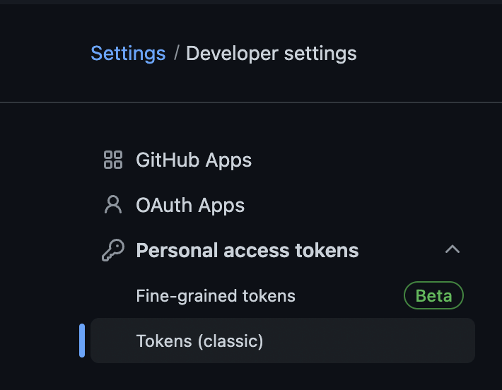

### github action 찍먹하기

github action 소개


최근 간략한 신규 프로젝트를 진행하면서, 별도의 CI/CD 대신 github action을 통해서 CI/CD 의 기능을 구현해보았는데, 생각보다 편리하고 쓸만하여, github action에 대하여 찍먹하기 정리를 해보았습니다.

**github action 이란? github 에서 제공하는 workflow feature**입니다. [github의 공식 홈페이지](https://github.com/features/actions)에서 이를 통하여 결국 CI/CD 의 기능을 할 수 있다고 소개하고 있습니다.  사실 CI/CD 라고 했을때 Jenkins, Travis CI, CirCleCI 등등 와 같은 여러 툴들이 이미 존재하고, 이미 수많은 프로젝트에서 해당 툴들을 사용하고 있습니다.

결론부터 이야기 하자면, 이미 만들어진 바퀴를 또 발명할 필요가 없듯, 이미 잘 사용하고 있고, 탄탄하게 구축된 CI/CD 가 있다면, 굳이 github action을 쓰지 않아도 됩니다. 하지만 신규 프로젝트이고 github을 사용한다면 **github action**을 통한 workflow(CI/CD) 구축은 **충분히 고려해 볼만한 좋은 옵션**인것 같습니다.


출처: [https://docs.github.com/assets/cb-25535/mw-1000/images/help/images/overview-actions-simple.webp](https://docs.github.com/assets/cb-25535/mw-1000/images/help/images/overview-actions-simple.webp)

### 할 수 있는 건?

사실 **CI/CD 에서 할 수 있는 대부분은 다 할 수 있습니다**. 보통 CI/CD을 통해서 가장 많이 사용하는 기능 역시 당연히 가능합니다. 예를 들어서 아래와 같은 것들 말이죠.(그외 여러가지 자동화된 CI/CD가 가능합니다.)

- pull request 을 자동 코드리뷰하기
- code lint, code unit test 돌리기
- build 돌리기
- deploy 하기
- cron 형태로 돌리기

### 장점

#### **“모든것이 github 화면에서 이루어진다”**

예를 들어 pull request을 만들었을때 자동으로, lint나 unit test을 하고, 해당 결과을 pull request에 comment로 작성하고, approve나 request changes 을 남기는 등의 동작이 가능합니다.

사실 **github 자체가 webhook 및 github rest api 을 지원**하기 때문에, **다른 CI/CD 툴을 이용하여도**, 위 동작이 가능하기는 합니다. 하지만 다른 CI/CD 툴은 해당 툴의 화면과 github 화면을 서로 스위치 하면서 봐야하는데, 이에 반해 github의 actions은 동일한 web page에서 action탭을 어떤 CI/CD 용 Job이 어떻게 돌아서 해당 형태를 남겼는지 확인 할 수 있습니다. 글로 쓰니 큰 장점처럼 안보이는데, 이 작은 요소가 개인적으로는 생각보다 매우 편리했습니다.


해당 화면에서, 탭만 바꾸어 가면서 다 볼 수 있다. (Actions → Rull Request → Issue → Code 등등…)


#### **“CI/CD 을 위한 설정, 코드 관리가 편해진다”**
예를 들어 Jenkins을 사용한다고 했을때, 위 workflow에서 할 수 있는 여러가지 일을 한다고하면, Jenkins의 Job 의 각 Step(task)설정에 그러한 여러가지 일들에 대한 설정을 하여야 합니다. 예를 들어 git에서 코드 받기, lint 테스트 돌리기, 빌드 돌리기 등등이 필요하면, 각각의 대한 내용을 Jenkins의 Step(Task)설정에서 하게 되고, 결국 이러한 설정은 Jenkins내부에서 관리되게 됩니다. 이에 반해 github action을 사용하면, 이러한 각 Job(Step, Task)을 동일한 프로젝트 소스코드 `.git/workflow` 에서 같이 관리하게 됩니다.


#### **“이미 구현된 수많은 github actoins”**
물론 다른 CI/CD 툴들 역시 이러한 plugin형태의 기능을 제공하고 있지만, 개인적인 사용경험상 github action쪽의 사용이 훨씬 편하였습니다. 별도의 설치 없이 사용하거나, 설치 역시 [marketplace](https://github.com/marketplace) 에서 단순 클릭으로 사용가능한 수준 이었습니다. 좀 과정하여 비교하자면, 어떤 CI/CD 툴은 java지식이 있어야 하고, jar등을 받아서, 직접 본인이 해당 jar을 올려서 설치하는 형태라면… github action은 별도 설치 없어도 “github주소/프로젝트주소@프로젝트ref”(`{owner}/{repo}@{ref}`) 을 통하여 곧바로 사용가능한 형태 입니다.

#### “개발자가 직접 custom action을 구현하기 쉽다!” 입니다.
[github 에서 가이드](https://docs.github.com/ko/actions/creating-actions/about-custom-actions)하는 형태를 통하여, public github에 개발자가 만든 custom action을 소스코드(github source repository)형태 그대로 구현 및 공유 할 수 있습니다.

#### **장점 요약**

- github 에서 all in one 처럼 사용하는 사용성.
- CI/CD 역시 코드 관리가 필요한데, 내 소스코드 내부에 `.git/workflow` 에서 같이 관리 가능.
- [marketplace](https://github.com/marketplace)  을 통하여 제공되는 수많은 이미 구현된 third party actions들이 제공.
- 개발자가 custom action을 만들고, 공유하기 쉽다.

### 단점

사용하면서 아주 큰 단점을 발견하지는 못한거 같습니다. github action의 단점이면 사실상 다른 CI/CD툴에서도 비슷한 단점이 있는거 같습니다. 개인적으로 느낌 몇가지 단점을 생각해보자면.

- 대규모 프로젝트(enterprise)에서 사용시 유료 사용 필요
- self-hosted runner 사용시 별도의 host 구축(서버구축) 및 관리 필요.
- 기존에 사용하던 CI/CD와 다른 새로운 형태(github action)의 설정을 다시 공부해야함(learning curve).

사실 기존에 이미 CI/CD 사용 경험이 있다면, learning curve 는 생각보다 적습니다. CI/CD에서 사용하는 용어 (Step, Job, Task)나 구동되는 형태등이 비슷합니다. 따라서 단점으로 적어보긴 하였지만, 사실 크게 걱정할 필요없이 조금만 찾아보면, 쉽게 구축하여 사용 가능한 수준입니다.

---

### 간략 예제로 찍먹하기

본 글은 찍먹으로 github action의 모든 요소를 알아보지는 않습니다. 사시 해당 부분은 공식 문서을 참고하시면 됩니다. 다만 찍먹할때 실제 이러한 부분을 통해서 구축한다 정도만 언급하겠습니다.

**미리 설정하여야 하는 것**

- github의 각 프로젝트 > Settings 탭 > Actions 설정

    

    - 적용하려는 action의 권한등을 설정합니가.
    - Runners같은 경우, 직접 서빙하는 Server을 통해서 Action을 구동할지, 아니면 github이 제공하는 서버를 통해서 Action을 구동할지 설정 할 수 있습니다.
        - self-hosted는 사실 Jenkins등을 직접 self-hosted로 구동하여 서빙하는 컨셉하고 비슷합니다.
        - workflow의 구동이 해당 서버에서 되고, 그 결과 등도 해당 서버에 저장됩니다.
- 사용하는 action이 github auth key(github token)가 필요한 경우 auth키 발급 필요
    - 해당 key는 특정 reposigory쪽에 등록하는 ssh key와는 다른형태로 있습니다.
    - [https://github.com/settings/profile](https://github.com/settings/profile)  하위의 Developer settings 의 Personal accrss tokens 메뉴를 통하여 생성 가능합니다.
        - [https://github.com/settings/tokens](https://github.com/settings/tokens)

            


**실제 workflow 설정**

- 설정 파일은 yml 형태입니다.
- 설정 파일은 `{github-owner}/{:project}/.github/workflows` 에 위치합니다.
    - 즉 내 github 계정이 gseok 이고, project가 action-test 라면
    - gseok/action-test/.github/workflows/{:workflow-setting-file.yml} 형태 입니다.
- 설정파일의 상세 내용은 아래 참고 링크를 참고하세요

**workflow 설정(메타) yml 파일 예제**

```jsx
name: "workflow 작업이름"

# inputs 필드는 optional합니다.
# workflow에서 사용할 매개변수 사용시 만들어 씁니다. 자세한건 공식 문서 참고하세요
# 참고: https://docs.github.com/ko/actions/creating-actions/metadata-syntax-for-github-actions#inputs
inputs:
  num-octocats:
    description: 'Number of Octocats'
    required: false
    default: '1'
  octocat-eye-color:
    description: 'Eye color of the Octocats'
    required: true

# on 구분은 해당 workflow가 자동 구동(trigger)될 조건이 됩니다.
# 즉 일종의 event listener 라고 이해해도 됩니다.
# 아래는 develop브랜치에 push가 발생하거나, 아무태그나 태그가 push 되면 workflow 가 구동됩니다.
# 이외에도, 이슈 생성, pull-request, comment등 여러 조건에 따른 workflow trigger 설정이 가능합니다.
# 참고: https://docs.github.com/ko/actions/using-workflows/triggering-a-workflow
on:
  push:
    tags:
      - '*'
    branches: develop

# workflow에서 구동할 Job(작업)을 생성 가능합니다.
# jobs: 바로 하위의 이름은 직접 생성하면됩니다. 아래 예시는 (build-lib)이라는 이름의 job을 만들었습니다.
# 종속적인 형태(1번 job이 먼저 완료되어야 2번 job구동)도 가능합니다. (needs키워드 사용)
# 참고: https://docs.github.com/ko/actions/using-jobs/using-jobs-in-a-workflow
jobs:
  build-lib:

    # workflow에서 작업을 처리할 실행기 - 컴퓨터(server)을 지정합니다.
    # self-hosted을 사용시 직접 해당 컴퓨터(server)을 구축하고
    # github의 각 프로젝트 > Settings 탭 > Actions 설정 을 통하여 해당 컴퓨터(server)가 등록되어 있어야 합니다.
    # github이 직접 제공하는 실행기 사용도 가능합니다.
    # 참고: https://docs.github.com/ko/actions/using-jobs/choosing-the-runner-for-a-job
    runs-on: [ self-hosted ]


    # 조건이나, 행렬 등을 이용하여, 최종 steps에서 실제 구동될 부분에 대한 컨트롤이 가능합니다.
    # 아래 예시에는 node-version이 하나만 있는데 만약, 해당 부분이 [12, 16, 18] 이라면
    # 별도 설정없이 총 3개의 작업 node 12, node 16, node 18 이 구동됩니다.
    # 참고: https://docs.github.com/ko/actions/using-jobs/using-a-matrix-for-your-jobs
    strategy:
      matrix:
        node-version: [18.13.0]

    # 해당 Job에서 실행될 각각의 Step을 생성합니다.
    # 각각의 step은 각각의 process로 구동됩니다.
    # 참고: https://docs.github.com/ko/actions/using-workflows/workflow-syntax-for-github-actions#jobsjob_idsteps
    steps:

    # 참고: https://docs.github.com/ko/actions/using-workflows/workflow-syntax-for-github-actions#jobsjob_idstepsuses
    - name: Code checkout        # step의 이름입니다.
      # uses을 사용하면, 외부 레파지토리등에 존재하는 action.yml을 통해서 step action을 구동가능합니다.
      uses: actions/checkout@v3  # 해당 step에서 구동할 재사용가능한 action입니다

    - name: Use Node.js ${{ matrix.node-version }}
      uses: actions/setup-node@v3
      with:
        node-version: ${{ matrix.node-version }}

    # 참고: https://docs.github.com/ko/actions/using-workflows/workflow-syntax-for-github-actions#jobsjob_idstepsrun
    - name: Build
      # run을 사용하면, cli 형태의 명령어를 구동할 수 있습니다.
      run: |
        npm install -g yarn@1.22.19
        yarn install
        yarn build:client:real

    # 참고: https://docs.github.com/ko/actions/using-workflows/workflow-syntax-for-github-actions#jobsjob_idstepswith
    - name: Upload binaries to release
      uses: svenstaro/upload-release-action@v2
      # with을 사용하면, 위 uses의 action구동시 필요한(정의된 inputs - 매개변수)변수에 값을 전달
      # 하면서 action을 구동할 수 있습니다.
      with:
        repo_token: my_github_token
        file: dist/my-build-result.zip
        asset_name: my-build-result.zip
        tag: ${{ github.ref }}
```

### 정리
github action에 대하여 간략하게 찍먹형태로 알아보았습니다. 서두에 이야기한것처럼 현재 github을 사용중인데, 프로젝트에 새롭게 CI/CD을 구축해야 하는경우, 도입을 고민해볼만한 좋은 기능인듯 합니다.

### 참고

- github action 공식 홈페이지 - [https://github.com/features/actions](https://github.com/features/actions)
- github action 공식 문서
    - [https://docs.github.com/en/actions](https://docs.github.com/en/actions)
    - [https://docs.github.com/ko/actions/learn-github-actions/understanding-github-actions](https://docs.github.com/ko/actions/learn-github-actions/understanding-github-actions)
- github action 설정
    - [https://docs.github.com/ko/actions/using-workflows/workflow-syntax-for-github-actions](https://docs.github.com/ko/actions/using-workflows/workflow-syntax-for-github-actions)
    - [https://docs.github.com/ko/actions/creating-actions/metadata-syntax-for-github-actions](https://docs.github.com/ko/actions/creating-actions/metadata-syntax-for-github-actions)
    - [https://docs.github.com/ko/actions/using-workflows/triggering-a-workflow](https://docs.github.com/ko/actions/using-workflows/triggering-a-workflow)
    - [https://docs.github.com/ko/actions/using-jobs/using-jobs-in-a-workflow](https://docs.github.com/ko/actions/using-jobs/using-jobs-in-a-workflow)
    - [https://docs.github.com/ko/actions/using-jobs/choosing-the-runner-for-a-job](https://docs.github.com/ko/actions/using-jobs/choosing-the-runner-for-a-job)
    - [https://docs.github.com/ko/actions/using-jobs/using-a-matrix-for-your-jobs](https://docs.github.com/ko/actions/using-jobs/using-a-matrix-for-your-jobs)
    - [https://docs.github.com/ko/actions/using-workflows/workflow-syntax-for-github-actions#jobsjob_idstepsuses](https://docs.github.com/ko/actions/using-workflows/workflow-syntax-for-github-actions#jobsjob_idstepsuses)
    - [https://docs.github.com/ko/actions/using-workflows/workflow-syntax-for-github-actions#jobsjob_idstepsrun](https://docs.github.com/ko/actions/using-workflows/workflow-syntax-for-github-actions#jobsjob_idstepsrun)
    - [https://docs.github.com/ko/actions/using-workflows/workflow-syntax-for-github-actions#jobsjob_idstepswith](https://docs.github.com/ko/actions/using-workflows/workflow-syntax-for-github-actions#jobsjob_idstepswith)
- github action marketplace
    - [https://github.com/marketplace](https://github.com/marketplace)
- github action 가격
    - [https://github.com/features/packages#pricing](https://github.com/features/packages#pricing)
    - [https://docs.github.com/en/billing/managing-billing-for-github-actions/about-billing-for-github-actions](https://docs.github.com/en/billing/managing-billing-for-github-actions/about-billing-for-github-actions)
    - [https://github.com/pricing/calculator?feature=actions](https://github.com/pricing/calculator?feature=actions)
- github api - [https://docs.github.com/en/rest](https://docs.github.com/en/rest)