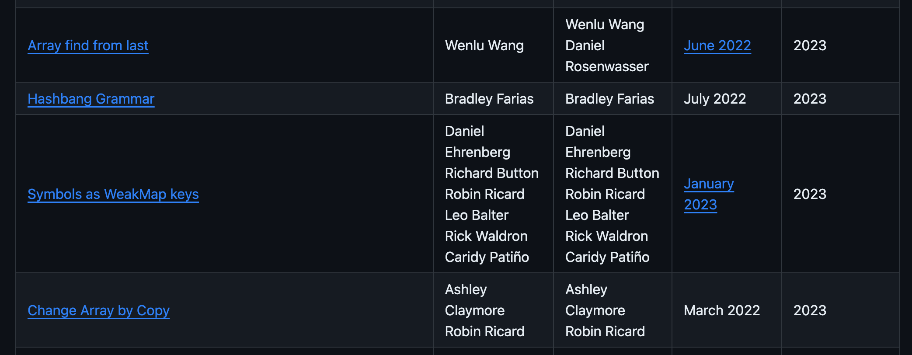

### 소개

es2023(es14) 가 2023년 6월 화정되었다 (이후는 es2024(es15)의 진행이다), 관련하여, es2023(es14)의 신규 feature들을 알아본다.

### 신규 Feature들은 어디서 알아보나?

- 공식 [proposals 문서](https://github.com/tc39/proposals/blob/HEAD/finished-proposals.md)를 통하여 어떤 기능들이 추가되었나 살펴볼 수 있다.



### Array find from last, Array by copy

- es2023(es14) - https://github.com/tc39/proposal-array-find-from-last
- es2023(es14) - [https://github.com/tc39/proposal-change-array-by-copy](https://github.com/tc39/proposal-change-array-by-copy)
- **신규 기능 proposal의 이유들**
    - 기존 배열 탐색 함수(`find`)는 앞에서 붙어 찾기 때문에, 맨뒤에 값이 있는 경우, 성능 문제가 있다.
        - 이를 해결하기위해 `reserve().find()` 을 사용하는경우, 원본 배열이 변경되는 side-effect가 있다.
    - 원본 배열이 변경되어도, react에서는 배열 자체가 동일객체여서 re-render가 발생하지 않는 문제가 있다. (즉 obj 참조형태)
        - 따라서 별도 복사본을 생성하여 해결이 필요하다. ([react문서 참고](https://react.dev/learn/updating-arrays-in-state))

**배열 검색 관련 추가 함수**

- Array.prototype.findLast → undefind | item
- Array.prototype.findLastIndex() → -1 | findIndex

**배열 복사 관련 추가 함수**

- Array.prototype.toReversed() -> Array
- Array.prototype.toSorted(compareFn) -> Array
- Array.prototype.toSpliced(start, deleteCount, ...items) -> Array
- Array.prototype.with(index, value) -> Array

### findLast, findLastIndex

- find와 달리 배열의 맨 뒤에서 부터 탐색하는 함수
- 기존 reverse().find() 을 사용할때 원본 배열이 변경(reserve)되는것을 방지 할 수 있고. 요소가 뒤에 있는 경우 성능 향상이 있다.

```jsx
codeconst array = [{ value: 1 }, { value: 2 }, { value: 3 }, { value: 4 }];

array.find(n => n.value % 2 === 1); // { value: 1 }
array.findIndex(n => n.value % 2 === 1); // 0

// ======== Before =========== 

// find
[...array].reverse().find(n => n.value % 2 === 1); // { value: 3 }

// findIndex
array.length - 1 - [...array].reverse().findIndex(n => n.value % 2 === 1); // 2
array.length - 1 - [...array].reverse().findIndex(n => n.value === 42); // should be -1, but 4

// ======== new =========== 
// find
array.findLast(n => n.value % 2 === 1); // { value: 3 }

// findIndex
array.findLastIndex(n => n.value % 2 === 1); // 2
array.findLastIndex(n => n.value === 42); // -1
```

### toReversed

- 순서가 reserve된 새로운 배열을 리턴한다.
- 기존 reserve함수와 달리 원본 배열을 변경하지 않는다.

```jsx
// ======== Before =========== 
const before = [1, 2, 3];
before.reversed(); // => [3, 2, 1]
before; // => [3, 2, 1]

// ======== new =========== 
const sequence = [1, 2, 3];
sequence.toReversed(); // => [3, 2, 1]
sequence; // => [1, 2, 3]
```

### toSorted

- 정렬이된 새로운 배열을 리턴한다.
- 기존 sort함수와 달리 원본 배열을 변경하지 않는다.

```jsx
// ======== Before =========== 
const before = [5, 3, 10, 7, 1];
const before_sort = before.sort();
console.log(before_sort); // => [1, 10, 3, 5, 7]
console.log(before); // => [1, 10, 3, 5, 7]

const before2 = [5, 3, 10, 7, 1];
const before_sort2 = before2.sort((a, b) => a - b);
console.log(before_sort2); // => [1, 3, 5, 7, 10]
console.log(before2); // => [1, 3, 5, 7, 10]

// ======== new =========== 
const numbers = [5, 3, 10, 7, 1];

const sorted = numbers.toSorted();
console.log(sorted); // => [ 1, 10, 3, 5, 7 ]
console.log(numbers); // => [5, 3, 10, 7, 1]

const sortedCorrectly = numbers.toSorted((a, b) => a - b);
console.log(sortedCorrectly); // => [1, 3, 5, 7, 10]
console.log(numbers); // => [5, 3, 10, 7, 1]
```

### toSpliced

- splice된 새로운 배열을 리턴한다.
- 동일하게 기존 splice와 달리 원본 배열을 변경하지 않는다.
- 기존  splice 함수가 제거된 요소를 리턴하는것과 달리, toSpliced 함수는 제거되고 남은 요소를 리턴한다.

```jsx
// 3번째 인자 없이 구동하는 케이스
// ======== Before =========== 
const before = [1, 2, 3, 4, 5];
const before_splice = before.splice(0, 2);
console.log(before_splice); // => [1, 2]
console.log(before); // [3, 4, 5]

// ======== new =========== 
const number = [1, 2, 3, 4, 5];
const spliced = number.toSpliced(0, 2);
console.log(spliced); // => [3, 4, 5]
console.log(number); // => [1, 2, 3, 4, 5]

// 3번째 인자가 있는경우
// ======== Before =========== 
const before = [1, 2, 3, 4, 5];
const before_splice = before.splice(0, 2, ...[10, 11]);
console.log(before_splice); // => [1, 2]
console.log(before); // [10, 11, 3, 4, 5]

// ======== new =========== 
const number = [1, 2, 3, 4, 5];
const spliced = number.toSpliced(0, 2, ...[10, 11]);
console.log(spliced); // => [10, 11, 3, 4, 5]
console.log(number); // => [1, 2, 3, 4, 5]

// new 방법을 이용하여서, 기존처럼 제거된 요소만 가져오게 하고, 원본이 변경되지 않게 하기
number.toSpliced(2, 3); // => [1, 2]
```

### Array Copy 관련 함수(toReversed, toSorted, with)는 TypedArrays 도 지원한다

`toReversed`, `toSorted`, and `with` will also be added to TypedArrays:

- TypedArray.prototype.toReversed() -> TypedArray
- TypedArray.prototype.toSorted(compareFn) -> TypedArray
- TypedArray.prototype.with(index, value) -> TypedArray
- These methods will then be available on subclasses of `TypedArray`. i.e. the following:
    - Int8Array
    - Uint8Array
    - Uint8ClampedArray
    - Int16Array
    - Uint16Array
    - Int32Array
    - Uint32Array
    - Float32Array
    - Float64Array
    - BigInt64Array
    - BigUint64Array

### with

- 배열의 특정 index의  value을 변경하고, 변경된 새로운 배열을 리턴한다.
- 원본 배열의 값을 교체되지 않는다.
- 기존에는 splice을 활용하여 특정 인덱스 앞, 뒤를 잘라내고, Index의 값을 변경하거나, index 을 알아낸뒤 해당 index에 값을 직접 assign 하는 형태를 취하여, 원본의 변경을 신경써야 하지만 with로 쉽게 변경이 가능해졌다.

```jsx
// ======== Before =========== 
const before = [1, 2, 3, 4, 5];
const index = 2;
const value = 10;
// splice 활용
const oldWith1 = [...before.slice(0, index), value, ...before.slice(index+1)];
// index에 값 직접 넣기
const oldWith2 = (() => {
  const temp = [...before];
  temp[index] = value;
  return temp;
})();

// ======== new =========== 
const number = [1, 2, 3, 4, 5];
const newWith = number.with(2, 10);
console.log(newWith); // [1, 2, 10, 4, 5]
console.log(number); // [1, 2, 3, 4, 5]
```

### Hashbang Grammar

- es2023(es14) - https://github.com/tc39/proposal-hashbang
- unix계열에서, 스크립트 상단에 실행될 프로그램을 명시하는, cli 프로그램에서 일종의 de-facto인 [Shebang / Hashbang](https://en.wikipedia.org/wiki/Shebang_(Unix)) 문법을 일치시킨다.
    - 즉 js파일내에 hashbang을 명시하는경우, javascript엔진이 해당 라인을 무시하게 한다.
- 기존과 달리진점은, hashbang을해석하는 과정이 javascript 엔진 내부에서 진행되도록 통일 되었다.

```jsx
#!/usr/bin/env node
// in the Script Goal
'use strict';
console.log(1);
```

```jsx
#!/usr/bin/env node
// in the Module Goal
export {};
console.log(1);
```

### Symbols as WeakMap keys

- es2023(es14) - https://github.com/tc39/proposal-symbols-as-weakmap-keys
- 기존에 weakmap의 key는 반드시 object여야 했는데, symbol역시 weakmap의 key로 사용 가능하게 하는 feature이다.
- 선행지식
    - WeakMap(es2015 - es6)
        - 약한 참조를 사용하여, 가비지 컬렉션을 방해하지 않는다.
        - 따라서 key를 obj로 한정했었다. (해당 obj가 사라지만 WeakMap의 value도 사라짐(가비지 컬렉션 됨)
        
        ```jsx
        // Map
        let data = { name: 'hwi' };
        const map = new Map();
        map.set(data, 'more info');
        
        data = null; // referece가 null (가비지!)
        
        // data가 map에 키로 사용(저장) 되어 있어서, 가비지 컬렉팅 되지 않음
        // map.keys() 로 호출하여 확인 가능.
        console.log(data) // => null
        console.log(map.keys()) // => [{ value: { name: 'hwi'} }]
        
        // WeakMap
        let data = { name: 'hwi' };
        const map = new WeakMap();
        map.set(data, 'more info');
        
        data = null; // referece가 null (가비지!)
        // map(WeakMap)에서 사실상 가비지 컬렉션 대상이 된다.
        // WeakMap에 아직 key - value가 남아 있더라도, 이를 access할 수 없다.
        // 왜냐하면 이미 key로 사용한 data 는 null이 되어서..!!
        ```
        
        - 사실 사용이 third party에 임시 데이터(임시 정보) 사용이나, 임시 cache등, WeakMap은 가비지컬렉션이 반대로 잘 이루어 져야하는 케이스 → 즉 “key인 obj가 제거”될때, “가비지 컬렉션이 잘 되는 케이스” 일때 활용하기 위한 문법이다.
    - Symbol(es2015 - es6)
        - 고유하고, 불변한 값을 나타내는 primitive data type이다.
        - 고유한 식별자를 생성할때 사용하고, 보통 객체의 키로 사용한다.
        - Symbol생성시 desc을 동일값을 주어도 서로다른(unique)한 식별자가 된다.
        
        ```jsx
        const sym1 = Symbol('hwi');
        const sym2 = Symbol('hwi');
        console.log(sym1 === sym2); // false
        
        // 객체 속성에 Symbol 사용
        const obj = {};
        const mySymbol = Symbol('mySymbol');
        obj[mySymbol] = 'Hello!';
        console.log(obj[mySymbol]); // 'Hello!'
        
        // 외부에서는 접근할 수 없음
        console.log(obj); // {}
        console.log(Object.keys(obj)); // []
        
        // Symbol을 키로 사용한 속성은 Object.getOwnPropertySymbols 메서드를 사용하여 접근할 수 있습니다.
        console.log(Object.getOwnPropertySymbols(obj)); // [Symbol(mySymbol)]
        ```
        

```jsx
const weak = new WeakMap();

// symbol을 weakmap의 키로 사용
const key = Symbol('my ref');
const someObject = { /* data data data */ };

weak.set(key, someObject);
```

- symbol을 weakmap key 로 추가적인 proposal에 긍정적 영향을 줄 수 있다고 한다.
    - [ShadowRealms, Membranes, and Virtualization](https://github.com/tc39/proposal-symbols-as-weakmap-keys#shadowrealms-membranes-and-virtualization)
    - [records & tuples](https://github.com/tc39/proposal-symbols-as-weakmap-keys#record-and-tuples)
    - 위 2개의 proposal모두 obj 미지원 문제가 있는데, weakmap(with symbol)을 활용하여 obj을 활용할 수 있는 형태의 영향을 줄 수 있다고 한다.

### 참고

- ecma(2023)
    - [https://tc39.es/ecma262/2023/](https://tc39.es/ecma262/2023/)
    - [https://ecma-international.org/publications-and-standards/standards/ecma-262/](https://ecma-international.org/publications-and-standards/standards/ecma-262/)
- git - https://github.com/tc39/ecma262
- mdn - [findLast](https://developer.mozilla.org/en-US/docs/Web/JavaScript/Reference/Global_Objects/Array/findLast)
- mdn - [with](https://developer.mozilla.org/en-US/docs/Web/JavaScript/Reference/Global_Objects/Array/with)
- mds - [WeakMap](https://developer.mozilla.org/en-US/docs/Web/JavaScript/Reference/Global_Objects/WeakMap)