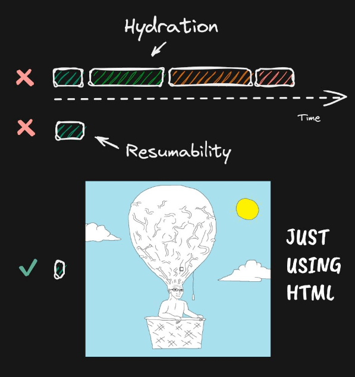
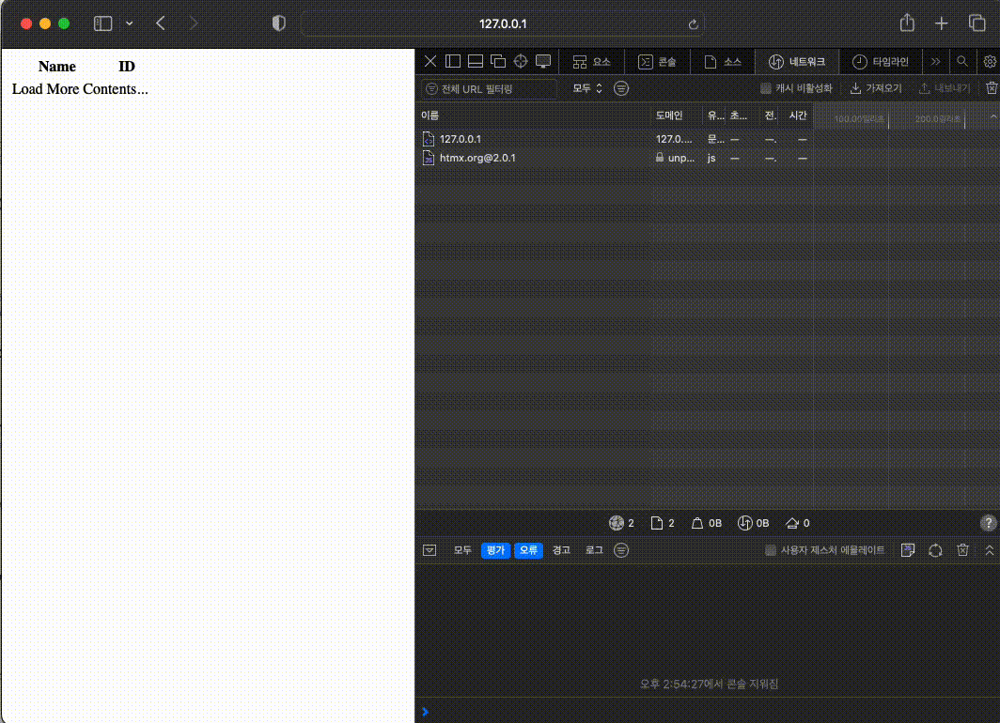
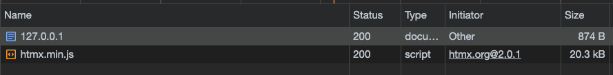

### 소개

htmx는 기존 js 의 ajax 호출 동작 이후 화면 갱신을 하는 구현 패턴와 달리, html 마크업 레벨에서 이를 지원하여 화면을 구성하는 구조를 가지는 프론트엔드 웹 프레임워크 이다.

html의 attribute 을 활용하여, html에서 직접 ajax, css transitions, websocket, sever send event 등을 컨트롤 한다.

**추가적인 특징**

- htmx 프레임웍 크기는 ([~14k min.gz’d](https://unpkg.com/htmx.org/dist/)) 정도로 작다.
- [dependency-free](https://github.com/bigskysoftware/htmx/blob/master/package.json) 이다. (응용하기에 따라 다른 frontend fw와 함께 사용이 자유롭다, node.js에서도 사용가능)
- 확장 가능한 구조를 가진다. ([extendable](https://extensions.htmx.org/))
- 동일 기능 구현시 js가 줄기 때문에 코드 사이즈를 줄여준다. ([67% when compared with react](https://htmx.org/essays/a-real-world-react-to-htmx-port/))
- [0BSD(Zero-Clause BSD) 라이선스](https://github.com/bigskysoftware/htmx/blob/master/LICENSE) 로 자유롭게 사용 가능하다.
- 현재(2024.07.18)기준 가장 최신 버전 - [v2.0.1](https://github.com/bigskysoftware/htmx/releases)
- 2020년에 시작된 프로젝트이다, [최초커밋](https://github.com/bigskysoftware/htmx/commit/e38dea64dd1065003a0e833d7b469d24e6bc2919)(문서가 약간 부실하다), 2022년 [intercooler.js](https://intercoolerjs.org/) 로부터 프로젝트 명칭을 변경(htmx)하여 ([v1.8.0](https://github.com/bigskysoftware/htmx/releases/tag/v1.8.0))출시하였다.

### motivation

- Why should only [`<a>`](https://developer.mozilla.org/en-US/docs/Web/HTML/Element/a) & [`<form>`](https://developer.mozilla.org/en-US/docs/Web/HTML/Element/form) be able to make HTTP requests?
- Why should only [`click`](https://developer.mozilla.org/en-US/docs/Web/API/Element/click_event) & [`submit`](https://developer.mozilla.org/en-US/docs/Web/API/HTMLFormElement/submit_event) events trigger them?
- Why should only [`GET`](https://developer.mozilla.org/en-US/docs/Web/HTTP/Methods/GET) & [`POST`](https://developer.mozilla.org/en-US/docs/Web/HTTP/Methods/POST) methods be [available](https://developer.mozilla.org/en-US/docs/Web/HTTP/Methods)?
- Why should you only be able to replace the **entire** screen?

위와 같은 제약 조건을 제거하여, htmx가 HTML을 [hypertext](https://en.wikipedia.org/wiki/Hypertext) 로 지원 하겠다는 철학.

### 기본적인 구현방식

```html
  
  <script src="https://unpkg.com/htmx.org@2.0.1"></script>
  
  <!-- have a button POST a click via AJAX -->
  <div hx-get="/clicked" hx-trigger="click" hx-swap="outerHTML">
    Click Me
  </div>
```

- [hx-post](https://htmx.org/attributes/hx-post/) - trigger 조건 발생시, `/clicked` api 을 get (ajax) 한다.
- [hx-trigger](https://htmx.org/attributes/hx-trigger/) - trigger의 조건을 결정한다. 위 예시 코드에서는 click 이다.
- [hx-swap](https://htmx.org/attributes/hx-swap/) - `/clicked` api응답을 사용하여, target의 html을 갱신 한다. 위 예시 코드에서는 outerHTML의 내용을 갱신 한다.

### AJAX

| Attribute | Description |
| --- | --- |
| https://htmx.org/attributes/hx-get/ | Issues a GET request to the given URL |
| https://htmx.org/attributes/hx-post/ | Issues a POST request to the given URL |
| https://htmx.org/attributes/hx-put/ | Issues a PUT request to the given URL |
| https://htmx.org/attributes/hx-patch/ | Issues a PATCH request to the given URL |
| https://htmx.org/attributes/hx-delete/ | Issues a DELETE request to the given URL |
- get, post, put, patch, delete 을 제공한다.

### Trigger

```html
<input name="q"
       hx-get="/search" hx-trigger="keyup changed delay:1s"
       hx-target="#search-results"/>
```

- key, click, load 등 여러형태의 trigger 을 제공하고, delay와 같은 기능들도 제공한다.
- 상세내용은 공식 문서를 참고 - [https://htmx.org/attributes/hx-trigger/](https://htmx.org/attributes/hx-trigger/)

### Core Attribute

| Attribute | Description |
| --- | --- |
| [hx-get](https://htmx.org/attributes/hx-get/) | issues a GET to the specified URL |
| [hx-post](https://htmx.org/attributes/hx-post/) | issues a POST to the specified URL |
| [hx-on](https://htmx.org/attributes/hx-on/) | handle events with inline scripts on elements |
| [hx-push-url](https://htmx.org/attributes/hx-push-url/) | push a URL into the browser location bar to create history |
| [hx-select](https://htmx.org/attributes/hx-select/) | select content to swap in from a response |
| [hx-select-oob](https://htmx.org/attributes/hx-select-oob/) | select content to swap in from a response, somewhere other than the target (out of band) |
| [hx-swap](https://htmx.org/attributes/hx-swap/) | controls how content will swap in (outerHTML, beforeend, afterend, …) |
| [hx-swap-oob](https://htmx.org/attributes/hx-swap-oob/) | mark element to swap in from a response (out of band) |
| [hx-target](https://htmx.org/attributes/hx-target/) | specifies the target element to be swapped |
| [hx-trigger](https://htmx.org/attributes/hx-trigger/) | specifies the event that triggers the request |
| [hx-vals](https://htmx.org/attributes/hx-vals/) | add values to submit with the request (JSON format) |
- html의 attribute로 제어하기 때문에 다양한 attribute을 제공한다.
- 자세한 부분은 공식 문서 참고 - [https://htmx.org/talk/#attributes](https://htmx.org/talk/#attributes)

### Javascript API

```jsx
  // add the class 'myClass' to the element with the id 'demo'
  htmx.addClass(htmx.find('#demo'), 'myClass');

  // add the class 'myClass' to the element with the id 'demo' after 1 second
  htmx.addClass(htmx.find('#demo'), 'myClass', 1000);
```

- helper형태의 javascript api도 제공된다.
- 자세한 부분은 공식 문서 참고 - [https://htmx.org/api/](https://htmx.org/api/)

### 기타

- Essays 을 통하여, Hypermedia application 에 대한 내용 및 htmx의 밈등을 소개하고 있다.
    
    

    출처: [https://htmx.org/essays/](https://htmx.org/essays/)
    
    
    
    출처: [https://htmx.org/essays/](https://htmx.org/essays/)
    

### 실습해보기

아래와 같은 간략한 코드를 활용하여, 실습 해본다.

해당 실습은 - [https://htmx.org/examples/click-to-load/](https://htmx.org/examples/click-to-load/) 을 직접 구현해본 케이스 이다.

- **index.html 와 /contents api을 제공하기 위한 간략한 node.js 서버**
    
    ```jsx
    const http = require('http');
    const url = require('url');
    const fs = require('fs');
    const path = require('path');
    
    const hostname = '127.0.0.1';
    const port = 3000;
    
    const server = http.createServer((req, res) => {
      const parsedUrl = url.parse(req.url, true);
      const getRandomItem = (arr) => {
        // 배열 길이를 기준으로 무작위 인덱스를 생성
        const randomIndex = Math.floor(Math.random() * arr.length);
        // 무작위 인덱스의 아이템을 반환
        return arr[randomIndex];
      }
    
      // 요청 URL이 /contents 인 경우
      if (parsedUrl.pathname === '/contents') {
        // 응답 헤더 설정
        res.writeHead(200, { 'Content-Type': 'text/html' });
    
        // 응답 데이터
        const names = ['Yumbeni', 'Butterful', 'DDogas', 'Pikachu', 'Majayoung'];
        const contents = `<tr id="replaceMe"></tr><tr><td>${getRandomItem(names)} Test...</td><td>${Date.now()}</td></tr>`;
    
        // HTML 형식으로 응답 전송
        res.end(contents);
        return;
      }
    
      // 요청 URL이 / 또는 /index.html인 경우
      if (parsedUrl.pathname === '/' || parsedUrl.pathname === '/index.html') {
        // index.html 파일 경로 설정
        const filePath = path.join(__dirname, 'index.html');
        
        // 파일을 비동기적으로 읽기
        fs.readFile(filePath, 'utf8', (err, data) => {
          if (err) {
            // 파일 읽기 오류 처리
            res.writeHead(500, { 'Content-Type': 'text/plain' });
            res.end('500 Internal Server Error');
          } else {
            // 성공적으로 파일을 읽었을 때 응답 전송
            res.writeHead(200, { 'Content-Type': 'text/html' });
            res.end(data);
          }
        });
        return;
      }
    
      // 404 Not Found 처리
      res.writeHead(404, { 'Content-Type': 'text/plain' });
      res.end('404 Not Found');
    });
    
    server.listen(port, hostname, () => {
      console.log(`Server running at http://${hostname}:${port}/`);
    });
    
    ```
    
- **실습(htmx)코드 - index.html**
    
    ```jsx
    <html>
      <head>
        <script src="https://unpkg.com/htmx.org@2.0.1" integrity="sha384-QWGpdj554B4ETpJJC9z+ZHJcA/i59TyjxEPXiiUgN2WmTyV5OEZWCD6gQhgkdpB/" crossorigin="anonymous"></script>
      </head>
      <body>
        <table>
          <thead>
            <tr><th>Name</th><th>ID</th></tr>
          </thead>
          <tbody>
            <tr id="replaceMe"></tr>
            <!-- button area -->
            <tr>
              <td colspan="2">
                <div class='btn primary'
                        hx-get="/contents"
                        hx-target="#replaceMe"
                        hx-swap="outerHTML"
                >
                  Load More Contents...
                </div>
              </td>
            </tr>
          </tbody>
        </table>
      </body>
    </html>
    ```
    

- 해당 실습 코드로 실제 구동하면, 아래와 같이 html내에 별도의 js없이 정상적으로 동작하는 것을 확인 할 수 있다.
    
    

- **실질적인 size**
    
    
    
    - htmx.min.js 가 20kB에 index.html이 880B로. 실질적으로 21kB 수준으로 구현되어있다.
    - 아주 간략한 기능인데 해당 부분을 react나, vue로 구현한 케이스를 가정하면, 실질적으로 js가 많이 줄어 들 수 있을꺼 같다.
    - 하지만 반대로, 본 연습 코드에서는 node코드에서 html str을 생성하여, 기존 json형태 대비 로직 증가 및 res data 증가 등이 추가될꺼 같다.

### 요약 및 느낀점

- 현재 frontend 개발 방법의 패러다임에서, html 을 markup이 아닌 language로 접근 하는 재미있는 framework.
- 사실 간략한 구현의 경우, ssr, rehydrate 등이 과할 수 있는데 이럴때 simple 한 해결책의 하나가 될 수 있을듯!
- htmx사용시 일부 구현에서는, 마치 구 jsp처럼, api의 응답이 json 형태의 data가 아니라. 실제 화면에 bind되어서 그려질 html string set 이 되어야 할 수도 있다.
- 클라이언트의 javascript의 내용이 줄어드는 만큼 경우에 따라서 서버의 로직 비용의 증가가 있을 수 있다.
- 실제 프로젝트에서는, 무조건적인 적용이 아니라 케이스에 따라서, 관리나 구현 복잡도 등을 고려하여서 적용하는게 좋을듯!!

### 참고

- home - https://htmx.org/
- doc - https://htmx.org/docs/
- git - https://github.com/bigskysoftware/htmx
- wiki - https://namu.wiki/w/htmx
