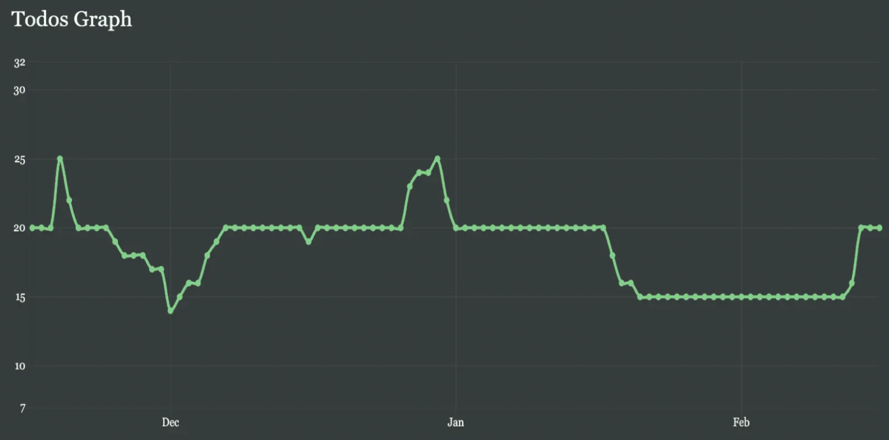
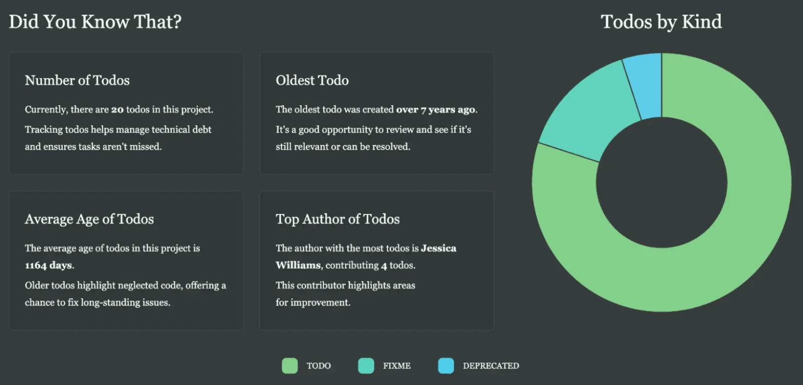
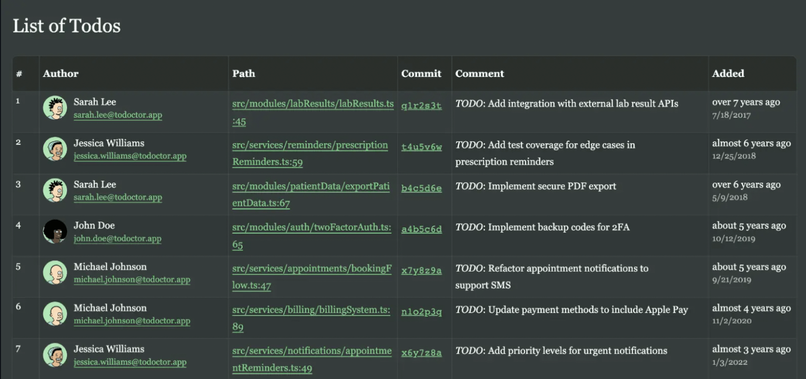

### 소개

**Todoctor**

- code 에서 TODO나 FIXME등의 주석을 분석하여, 기술부채를 나타내 주는 도구

**Why?**

- 개발자가 TODO 주석을 생성하는건 흔한 일이지만, 실제 이를 작업하여 수정하는 케이스가 드물다.
- 코드에 숨겨진 이러한 주석을 분석 추적 관찰 할 수 있도록 도와주는 도구이다.

**Feature**

- 코드에서 `TODO`, `FIXME`, `NOTE` 등의 주석을 자동으로 추출.
- JavaScript and TypeScript 지원.
- 각 커밋의 commment 히스토리를 수집하고 업데이트.
- `git blame` 을 활용한, 주석의 작성자와 작성 시기를 추적 통합.
- 기술 부채의 증가나 감소를 분석하기 위해 변화 내역을 시각화.

**사용법**

미설치 사용 - 프로젝트 root에서 아래 명령어 수행

```bash
$ npx todoctor
```

설치형태 사용

```bash
// 설치
$ npm install -g todoctor

// 사용 - 프로젝트 root에서 수행
$ todoctor

// 그외 help등 지원
$ todoctor --help
Todoctor is a powerful tool for analyzing, tracking, and visualizing technical
debt in your codebase using Git. It collects and monitors TODO/FIXME comments
in your code, allowing you to observe changes over time.

Usage: todoctor [OPTIONS]

Options:
  -m, --month <MONTH>
          Number of months to process [default: 3]
  -i, --ignore <IGNORE>
          Paths to ignore (can be used multiple times)
  -I, --include-keywords <INCLUDE_KEYWORDS>
          Keywords to track for TODO comments (can be used multiple times)
  -E, --exclude-keywords <EXCLUDE_KEYWORDS>
          Keywords to exclude from tracking (can be used multiple times)
  -f, --output-format <OUTPUT_FORMAT>
          Output format [default: html] [possible values: html, json, csv]
  -o, --output <OUTPUT>
          Output directory [default: todoctor]
  -h, --help
          Print help
  -V, --version
          Print version
          
          
 // output을 html 이나 json 파일로 생성도 가능
 $ todoctor --output-format json
```

**검출관련 키워드**

```tsx
TODO
FIXME
XXX
HACK
BUG
OPTIMIZE
REFACTOR
TEMP
CHANGED
IDEA
NOTE
REVIEW
NB
QUESTION
DEBUG
KLUDGE
COMPAT
WARNING
DANGER
INFO
DEPRECATED
COMBAK
```

**사용 결과 예시**

- https://todoctor.azat.io/

**사용결과**


- TODO형태의 기술 부채의 추이를 알 수 있도록 해주는 그래프



- 전체 TODO수, 가장 오래된 TODO, 전체 TODO의 평균 Age, TODO 담당자 등의 분석 화면



- TODO 목록 제공
    - 가장 유용한 기능
    - 해당 TODO의 생성자 및 위치(Path), Commit, 내용, 작성일 등을 보여준다.

### 총평

- 매우 간단하면서도, 유용한 도구이다. 보통 프로젝트에서 숨겨진 기술부채로 존재하게 되는 부분인데, 해당 툴을 통해서 지속적인, 프로젝트 기술 부채 관리가 가능하다.
- 또한 다음과 같은 응용 사용을 생각해 볼 수 있다.
    - 팀 내에서 사용하는 Admin Tool 등에 통합하여, 주기적인 모니터링.
    - CI/CD에 통합하여, 주기적으로 특정기간 이사의 TODO에 대하여, 담당자 메일 발송 혹은 메신저 알림 hook에 연동하여 알리기.
    - 개발툴의 plugin등으로 만들어서 개발시 IDE내에서 경고나 해당 화면을 볼 수 있도록 해주기.
- 잘 활용하면, 기술부채를 줄이고 코드를 더 깔끔하게 관리 할 수 있을꺼 같다.

### 참고

 https://github.com/azat-io/todoctor
