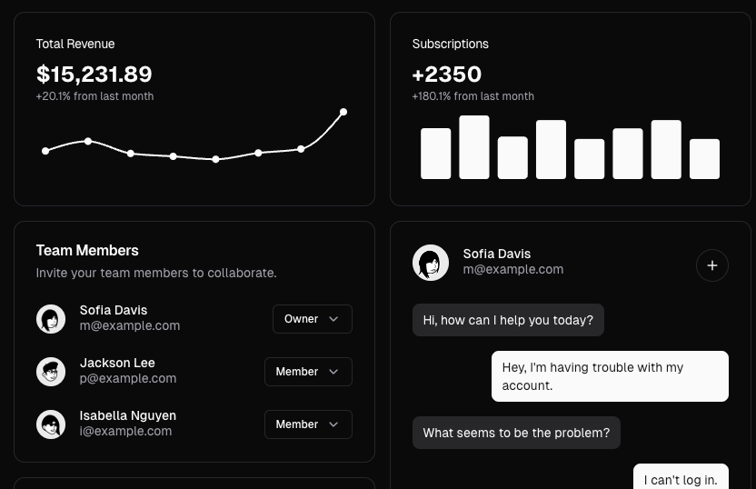
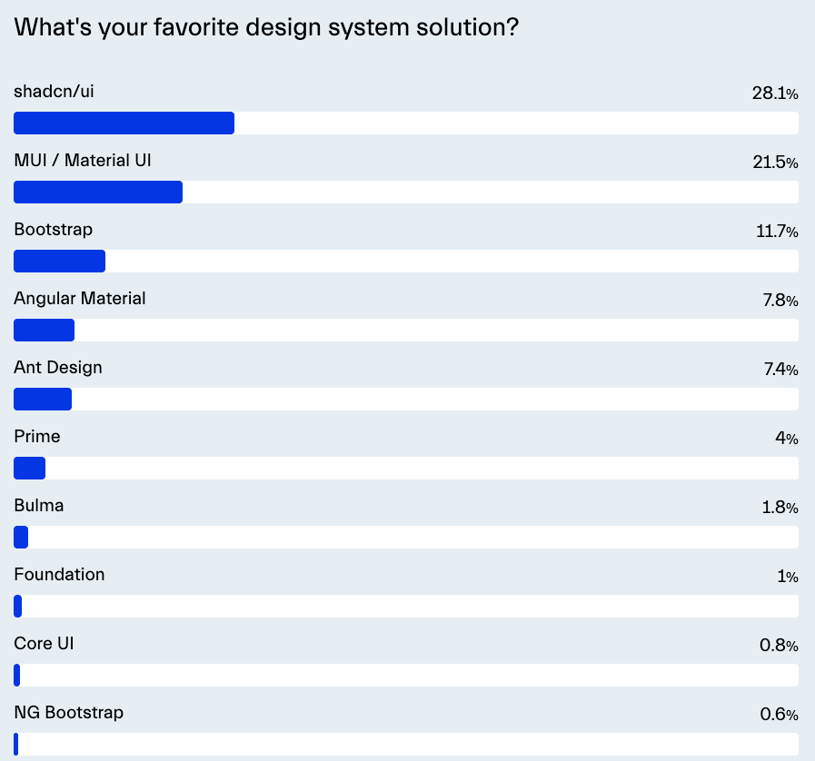

# shadcn/ui



[shadcn/ui](https://ui.shadcn.com/)는 React 애플리케이션을 위한 **재사용 가능한 컴포넌트 모음**입니다. Radix UI와 Tailwind CSS를 기반으로 구축되었으며, 아름답고 접근성이 뛰어난 컴포넌트를 제공합니다.

### 소개

공식 홈페이지에서 다음과 같이 소개하고 있습니다. 

shadcn는 컴포넌트 라이브러리가 아닙니다. shadcn은 재사용 가능한 컴포넌트의 모음 입니다. 

컴포넌트 라이브라리가 아니다!! 가 무슨 의미일까요? 

일반적인 컴포넌트 라이브러리(e.g. material ui, antd, 등등) 와 달리 npm install 형태의 설치를 하지 않습니다. 단지 필요한 컴포넌트가 있으면, 당신의 프로젝트에 코드를 copy and paste하고, 필요한만큼 커스텀하여 사용하면 됩니다. 또한 shadcn을 활용하여, 당신만의 컴포넌트 라이브러리를 구축하여 사용하면 됩니다.

### 주요 특징

- **복사-붙여넣기 방식:** NPM 패키지가 아닌, 필요한 컴포넌트만 복사하여 프로젝트에 통합할 수 있습니다.
- **커스터마이징 용이성:** 모든 컴포넌트는 쉽게 수정하고 스타일링할 수 있도록 설계되었습니다.
- **접근성 중심:** Radix UI를 기반으로 하여 뛰어난 접근성을 제공합니다.
- **타입스크립트 지원:** 모든 컴포넌트는 타입스크립트로 작성되어 있어 타입 안정성을 보장합니다.
- **다양한 컴포넌트지원**: Accordion, Card, Button등 총 50여개의 다양한 컴포넌트를 제공합니다.

### 사용 이점

shadcn/ui를 사용하면 다음과 같은 이점이 있습니다:

- 빠른 개발 속도: 미리 만들어진 고품질 컴포넌트를 바로 사용할 수 있습니다.
- 유연한 커스터마이징: 프로젝트의 요구사항에 맞게 컴포넌트를 수정할 수 있습니다.
- 최신 웹 트렌드 반영: 현대적인 디자인과 사용자 경험을 제공합니다.

### 시작하기

- 현존하는 여러 개발 framework 이나 개발 환경에서 설치하는 방법을 제공합니다.
    - next.js, vite, remix, astro, Laravel, Gatsby
- Manual 하게 수동 구성하는 방법역시 제공합니다.
- 예제(vite 환경에서의 설치)
    - tailwind 및 필요 모듈 설치
        
        ```bash
        $ pnpm add -D tailwindcss postcss autoprefixer
        ```
        
    - tailwind 기본 환경 설정
        
        ```bash
        $ pnpm dlx tailwindcss init -p
        ```
        
    - tailwind.config.js 내용 설정, content부분에 실제 component사용및 구현될 path들 작성
        
        ```jsx
        /** @type {import('tailwindcss').Config} */
        module.exports = {
          content: ["./index.html", "./src/**/*.{ts,tsx,js,jsx}"],
          theme: {
            extend: {},
          },
          plugins: [],
        }
        ```
        
    - global.css 나 index.css 에 기본 tailwindcss 적용
        
        ```css
        /* index.css or global.css 파일에 아래와 같이 tailwind추가 */
        @tailwind base;
        @tailwind components;
        @tailwind utilities;
         
        /* ... */
        ```
        
    - 프로젝트 main entry에 global.css나 index.css 로드
        
        ```tsx
        // 필수! 미적용시 프로젝트 빌드때, 제외되어 style(css)가 미적용 될 수 있다.
        import './index.css';
        
        export const App = () => {
          return (
            <div>my app</div>
          );
        };
        ```
        
    - typescript 사용시, tsconfig.json에 shadcn 컴포넌트를 위한 컴파일 설정 추가
        
        ```tsx
        {
          "compilerOptions": {
            "baseUrl": ".",
            "paths": {
              // 아래 "@/*" 에 실제 프로젝트 사용할 path명시
              "@/*": ["./src/*"]
            }
          }
        }
        ```
        
    - vite 사용시, shadcn 및  tailwindcss적용(빌드)을 위한 설정 추가
        
        ```tsx
        import path from "path"
        import react from "@vitejs/plugin-react"
        import tailwindcss from 'tailwindcss';
        import autoprefixer from 'autoprefixer';
        import { defineConfig } from "vite"
         
        export default defineConfig({
          plugins: [react()],
          resolve: {
            alias: {
              // @ 관련하여, 실제 프로제트에서 사용할 path명시
              "@": path.resolve(__dirname, "./src"),
            },
          },
          css: {
            // 기본적으로 vite가 css(postcss)처리를 하지만, 잘되지 않는경우, scss을 같이 쓰는 경우등
            // 필요시 수동으로 postcss 설정에 tailwindcss을 적용한다.
            postcss: {
              plugins: [
                tailwindcss(),
                autoprefixer(),
              ],
            },
          },
        })
        ```
        
    - shadcn-ui 초기화
        
        ```tsx
        $ pnpm dlx shadcn@latest init
        
        Which style would you like to use? › New York
        Which color would you like to use as base color? › Zinc
        Do you want to use CSS variables for colors? › no / yes
        
        수행후 components.json이 생성된다.
        ```
        
    - components.json확인
        
        ```json
        {
          "$schema": "https://ui.shadcn.com/schema.json",
          "style": "new-york",
          "rsc": false,
          "tsx": true,
          "tailwind": {
            "config": "tailwind.config.js",
            "css": "src/index.css",
            "baseColor": "zinc",
            "cssVariables": true,
            "prefix": ""
          },
          "aliases": {
            "components": "@/components",
            "utils": "@/lib/utils",
            "ui": "@/components/ui",
            "lib": "@/lib",
            "hooks": "@/hooks"
          },
          "iconLibrary": "lucide"
        }
        ```
        
    - 마지막으로 필요한 component을 copy & paste (혹은 shadcn cli)등을 활용하여 프로젝트에 추가하여 사용합니다.
        
        ```json
        $ pnpm dlx shadcn@latest add button
        ```
        
    - 다음과 같이 shadcn 컴포넌트가 프로젝트에 추가됩니다.
        
        ```tsx
        import * as React from "react"
        import { Slot } from "@radix-ui/react-slot"
        import { cva, type VariantProps } from "class-variance-authority"
        
        import { cn } from "@/lib/utils"
        
        const buttonVariants = cva(
          "inline-flex items-center justify-center gap-2 whitespace-nowrap rounded-md text-sm font-medium transition-colors focus-visible:outline-none focus-visible:ring-1 focus-visible:ring-ring disabled:pointer-events-none disabled:opacity-50 [&_svg]:pointer-events-none [&_svg]:size-4 [&_svg]:shrink-0",
          {
            variants: {
              variant: {
                default: "bg-white text-gray-900 hover:bg-gray-100 dark:bg-gray-800 dark:text-white dark:hover:bg-gray-700",
                destructive:
                  "bg-destructive text-destructive-foreground shadow-sm hover:bg-destructive/90",
                outline:
                  "border border-input bg-background shadow-sm hover:bg-accent hover:text-accent-foreground",
                secondary:
                  "bg-secondary text-secondary-foreground shadow-sm hover:bg-secondary/80",
                ghost: "hover:bg-accent hover:text-accent-foreground",
                link: "text-primary underline-offset-4 hover:underline",
              },
              size: {
                default: "h-9 px-4 py-2",
                sm: "h-8 rounded-md px-3 text-xs",
                lg: "h-10 rounded-md px-8",
                icon: "h-9 w-9",
              },
            },
            defaultVariants: {
              variant: "default",
              size: "default",
            },
          }
        )
        
        export interface ButtonProps
          extends React.ButtonHTMLAttributes<HTMLButtonElement>,
            VariantProps<typeof buttonVariants> {
          asChild?: boolean
        }
        
        const Button = React.forwardRef<HTMLButtonElement, ButtonProps>(
          ({ className, variant, size, asChild = false, ...props }, ref) => {
            const Comp = asChild ? Slot : "button"
            return (
              <Comp
                className={cn(buttonVariants({ variant, size, className }))}
                ref={ref}
                {...props}
              />
            )
          }
        )
        Button.displayName = "Button"
        
        export { Button, buttonVariants }
        
        ```
        
    - 컨포넌트 추가 위치는 components.json에 명시된 `"ui":  "@/components/ui"` 위치입니다.
    - 최종적으로 프로젝트에서 컴포넌트를 사용합니다.
        
        ```tsx
        import { Button } from "@/components/ui/button"
         
        export default function Home() {
          return (
            <div>
              <Button variant={"default"}>Click me</Button>
            </div>
          )
        }
        ```
        

### 주의사항 & 팁

- 기본적으로 컴포넌트 라이브러리가 아니지만, tailwindcss에 dependency가 존재합니다.
    - 물론 tailwindcss을 사용하지 않고, 직접 style(custom css)을 적용할 수 도 있습니다.
    - 하지만 실제 shadcn을 쉽고 편하게 사용하는 경우, 사실상 tailwindcss 사용이 필수입니다.
- 실제 컴포넌트 사용시, 컴포넌트 props중 variant, size 을 통해서 기본적인 스타일 적용을 할 수 있습니다.
- 필요시 사용자 정의(custom variant)을 추가된 컴포넌트에 정의하여 사용 할 수 있습니다.
    
    ```tsx
    const buttonVariants = cva(
      "inline-flex items-center justify-center gap-2 whitespace-nowrap rounded-md text-sm font-medium transition-colors focus-visible:outline-none focus-visible:ring-1 focus-visible:ring-ring disabled:pointer-events-none disabled:opacity-50 [&_svg]:pointer-events-none [&_svg]:size-4 [&_svg]:shrink-0",
      {
        variants: {
          variant: {
            default: "bg-white text-gray-900 hover:bg-gray-100 dark:bg-gray-800 dark:text-white dark:hover:bg-gray-700",
            mycustom: "bg-white text-gray-700" // 사용자 정의 variant을 만들고 사용 가능!
          },
          size: {
            default: "h-9 px-4 py-2",
          },
        },
        defaultVariants: {
          variant: "default",
          size: "default",
        },
      }
    )
    ...
    
    import { Button } from "@/components/ui/button"
     
    export default function Home() {
      return (
        <div>
          <Button variant={"mycustom"}>Click me</Button>
        </div>
      )
    }
    ```
    
- 기본적으로 tailwindcss 의 사용법을 그대로 적용하여 사용 할 수 있습니다.
- tailwindcss init시점 및 shadcn init시점에, tailwind.config.js와 compontns.json, main entry style file(global.css 나 index css)에 base(root) css setting이 적용됩니다. 필요시 이를 수정하여 사용 할 수 있습니다.
- vite 개발 환경의 경우, css와 scss을 같이 사용하는것도 가능합니다.
    - shadcn은 css로 global.css나 index.css을 적용하고, custom classname등을 tailwind와 무관하게 scss로 적용하는 형태도 가능합니다.

### 결론

[state of frontend](https://tsh.io/state-of-frontend/) 의 조사결과를 보면, 기존의 설치형 ui 라이브러리들을 역전하여, 가장 많이 사용하는 ui system으로 shadcn/ui 가 뽑혔습니다.



실제 사용자들이 기존 공통 컴포넌트 사용에 불편함을 느끼고 있다는 의미가 되며, 또한 tailwindcss을 기존 공통에 적용시에 어려운 점이 있다는 반증이 되는것 같습니다.

물론, 기존에 tailwindcss을 사용하지 않았다면, tailwind에 대한 러닝커브가 존재하는건 사실입니다.

그럼에도 불구하고, 더 많은 장점으로 shadcn/ui을 선택하는것 같습니다. 기존 ui 라이브러리들과 다른 넓은 확장성, tailwind사용시 좋은 궁합, 자체 구현하는 공통 컴포넌트 제공이나, 필요 컴포넌트 사용 및 실제 사용하는 컴포넌트 코드를, 내 코드에서 곧바로 수정하면서 사용 하는 등의 편의성이 존재합니다.

또한 팀에 마크업 개발자나, 퍼블리셔 가 없는 소규모 팀에서, 웹 개발자가 스타일(마크업) 및 기능 구현을 모두 해야 하는 경우에도 좋은 선택이 되는것 같습니다.

항상 그렇듯 정답이 있는건 아닙니다. 하지만 shadcn/ui는 현대적인 React 애플리케이션 개발을 위한 훌륭한 선택 옵션중 하나인것은 분명합니다. 접근성, 커스터마이징 가능성, 그리고 사용 편의성을 모두 갖춘 이 라이브러리는 개발자들에게 큰 가치를 제공합니다.

### 참고

- https://ui.shadcn.com/
- https://tsh.io/state-of-frontend/
- https://tailwindcss.com/docs/installation