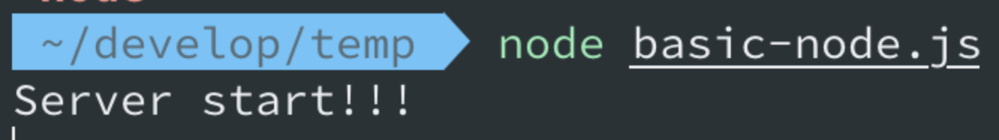
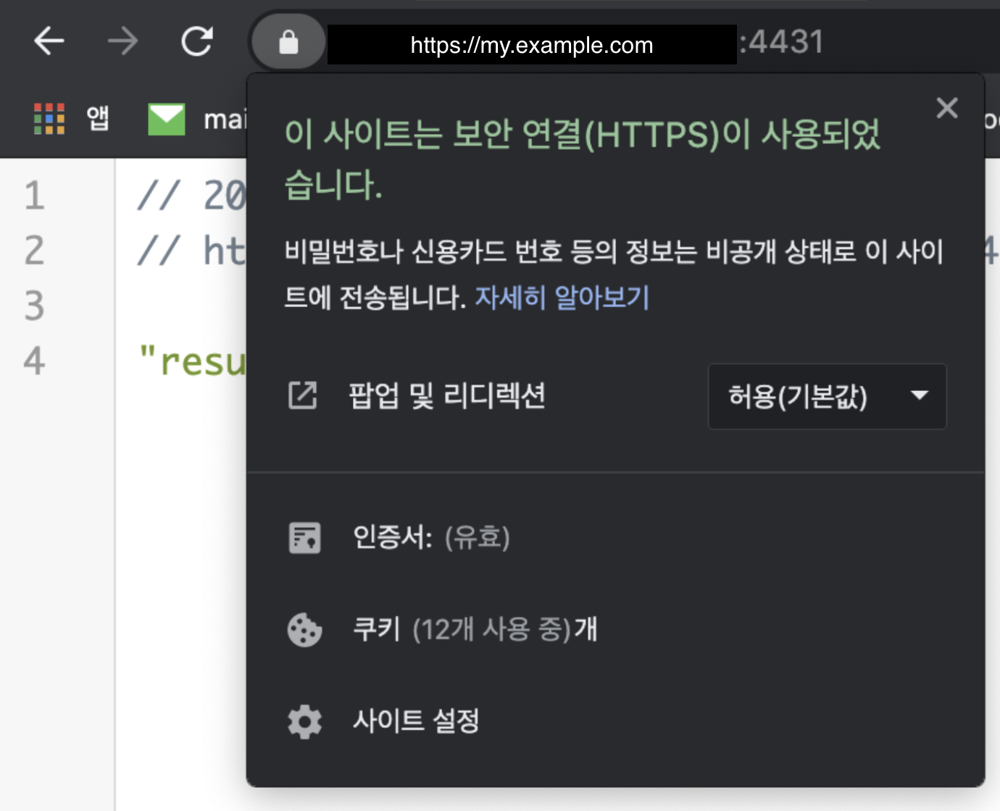

## **소개**

- Node.js 환경에서 https설정하는 방법을 설명한다.
- 현재 `my.example.com`은 이미 `cert`, `key` 가 존재한다.
- 다만 해당 파일이 `pem`파일로 되어있고, 현재는 `nginx`의 https의 설정용으로 되어 있다.
    - 또한 현재 nginx용 ssl은 `pass`을 받게 되어 있다.
- 따라서, node에서 해당 ssl(cert, key)을 바로 사용하는 경우 에러가 발생한다.
- 현재 이미 있는 nginx용 ssl을 node.js(webpack-dev-server)에서 사용하는 방법을 설명한다.

## **Node.js 에서 https설정하기**

- 정상적인 ssl(cert, key)가 존재하는 경우 아래와 같은 코드로 https설정이 가능하다.
- 공식Doc - [https://nodejs.org/api/https.html](https://nodejs.org/api/https.html)

```tsx
// curl -k https://localhost:8000/
const https = require('https');
const fs = require('fs');

const options = {
  key: fs.readFileSync('test/fixtures/keys/agent2-key.pem'),
  cert: fs.readFileSync('test/fixtures/keys/agent2-cert.pem')
};

https.createServer(options, (req, res) => {
  res.writeHead(200);
  res.end('hello world\n');
}).listen(8000);
```

```tsx
// 또는
const https = require('https');
const fs = require('fs');

const options = {
  pfx: fs.readFileSync('test/fixtures/test_cert.pfx'),
  passphrase: 'sample'
};

https.createServer(options, (req, res) => {
  res.writeHead(200);
  res.end('hello world\n');
}).listen(8000);
```

Node의 공식 문서에서 알 수 있는 사실

- 확장자가 `pem`, `key`, `pfx`, `cert`을 다 지원 가능
- ca을 넣지 않아도 무방
- pass을 넣는 부분은 없음

## **Express에서 https설정하기**

- 가장 기본이 되는 Node의 설정과 거의 동일하다.
- `webpack-dev-server`는 내부적으로 `express.js`을 사용하고 있기 때문에, `express.js`에서 정상 동작하면 사실상 `webpack-dev-server`에서 정상 동작한다.
- 이게 되면 사실상 거의 비슷한 구조인 `koa2.js`역시 동일한 형태로 `https`설정이 가능하다.

```tsx
const express = require('express');
const https = require('https');
const fs = require('fs');

const app = express();

// 더미 라우트 모든 req에 대해서 result을 res
app.use((req, res, next) => {
  return res.status(200).json('result');
});

const PORT = process.env.PORT || 4431;   // HTTPS 는 443 포트를 사용합니다

const options = {
  key: fs.readFileSync(__dirname + '/key.pem'),
  cert: fs.readFileSync(__dirname + '/cert.pem'),
};
// https 서버를 만들고 실행시킵니다
https.createServer(options, app).listen(PORT, () => {
  console.log('Server start!!!');
});
```

```tsx
// 또는 아래와 같이 https와 http둘다 지원되는 서버 구축 가능
const express = require('express');
const https = require('https');
const http = require('http');
const fs = require('fs');

const options = {
  key: fs.readFileSync('key.pem'),
  cert: fs.readFileSync('cert.cert'), // pem이건 cert이건 확장과 관계없음, 이는 base인 node.js가 지원해서 가능
};

// Create a service (the app object is just a callback).
const app = express();

// Create an HTTP service.
http.createServer(app).listen(80);
// Create an HTTPS service identical to the HTTP service.
https.createServer(options, app).listen(443);
```

## **webpack-dev-server의 https설정**

- 참고: [https://webpack.js.org/configuration/dev-server/#devserverhttps](https://webpack.js.org/configuration/dev-server/#devserverhttps)

```tsx
module.exports = {
  //...
  devServer: {
    https: {
      key: fs.readFileSync('/path/to/server.key'),
      cert: fs.readFileSync('/path/to/server.crt'),
      ca: fs.readFileSync('/path/to/ca.pem'),
    },
  },
};
```

- 문서상, webpack devServer설정상의 `https` object설정이 그대로, 더 위에서 설명한, node 혹은 express설정의 https생성(createServer) optioins로 들어간다.
- This object is passed straight to Node.js HTTPS module, so see the [HTTPS documentation](https://nodejs.org/api/https.html) for more information.

## **ssl키 local에서 생성해보기**

- 참고: [https://gist.github.com/gseok/cbc326896d9cc4d240201e3f59690ac9](https://www.notion.so/cbc326896d9cc4d240201e3f59690ac9)

**pre-required**

- openssl 이 있어야 한다.

**ssl.conf**

- cert파일 생성시 사용되는, ssl 설정 파일

```jsx
[ req ]
default_bits       = 4096
distinguished_name = req_distinguished_name
req_extensions     = req_ext

[ req_distinguished_name ]
countryName                 = IL
countryName_default         = GB
stateOrProvinceName         = Center
stateOrProvinceName_default = England
localityName                = Tel Aviv
localityName_default        = Brighton
organizationName            = CA
organizationName_default    = Hallmarkdesign
organizationalUnitName      = BlazeMeter
commonName                  = localhost
commonName_max              = 64
commonName_default          = localhost

[ req_ext ]
subjectAltName = @alt_names

[alt_names]
DNS.1   = localhost
```

**Generate private key**

- 비공개키 생성

```
$ openssl genrsa -out private.key 4096
```

**Generate a Certificate Signing Request**

- 비공개키와, ssl.conf(ssl 설정 파일)을 이용해서, sign파일(csr) 생성

```
openssl req -new -sha256 \
    -out private.csr \
    -key private.key \
    -config ssl.conf

```

**Generate the certificate**

- 비공개키 + 키 sign 파일 두개를 이용해서, cert 파일 생성(실질적인 인증서 파일!)
- 이때도 ssl.conf는 동일하게 사용됨

```
openssl x509 -req \
    -days 3650 \
    -in private.csr \
    -signkey private.key \
    -out private.crt \
    -extensions req_ext \
    -extfile ssl.conf
```

**Add the certificate to keychain and trust it:**

- local에서 생성한 ssl용 cert파일은, 공식 인증기관에서 인증한 키가 아니기 때문에 실제 사용시 브라우저에서, ```알수없는 인증기관``에서 인증 과련 경고가 발생
- 아래 로직은 임의로, 본인 컴퓨터에서 해당 key을 `믿을만한`키로 인식 하는 방법(개발용) 이다.

```
sudo security add-trusted-cert -d -r trustRoot -k /Library/Keychains/System.keychain private.crt
```

**Create a pem file from crt**

- 위 과정상으로 확장자가 crt인 인증서파일을 생성하였는데, 이 확장자를 openssl명령어로 벼경 가능하다.
- 쉽게 이해하자면, 특정 유틸프로그램(openssl)로 ```jpg > png```하는것과 비슷하다.
    - 즉 실질적인 기능은 동일한데, 확장자(내부 format)이 다른 type형태로 전환 가능

```
openssl x509 -in private.crt -out private.pem -outform PEM
```

**Run webpack dev server**

- 로컬에서 생성한 ssl (key and cert)을 가지고 webpack-dev-server or node.js 에서 https로 사용 가능하다.

```
npm run webpack-dev-server -- --open --https --cert private.pem --key private.key
```

## **ssl키 type 혹은 확장자 변경**

- 위 간략한 ssl키 local에서 생성 과정에서 알수 있듯, openssl로 ssl이 생성한 파일의 type(pem, key, crt 등)을 변경하거나, pem 에서 key을 추출하는등의 동작이 가능하다.
- 참고: [https://stackoverflow.com/questions/13732826/convert-pem-to-crt-and-key](https://stackoverflow.com/questions/13732826/convert-pem-to-crt-and-key)
- 참고: [https://stackoverflow.com/questions/991758/how-to-get-pem-file-from-key-and-crt-files](https://stackoverflow.com/questions/991758/how-to-get-pem-file-from-key-and-crt-files)
- 여기서는 몇가지 방법반 소개한다. 더 많은 방법은 위 참고 부분을 확인

**pem 파일에서 key & cert추출**

- 즉 key.pem -> key.key

```jsx
openssl pkey -in ./cert/key.pem -out key.key
// 위 명령어 시도시, Enter pass phrase 요청이 나옴 이때, nginx에서 쓰는 ssl.pass 파일에 기록된 값을 사용
```

- 또는

```
openssl rsa -in foo.pem -out foo.key
```

**Convert a DER file (.crt .cer .der) to PEM**

```
openssl x509 -inform der -in certificate.cer -out certificate.pem
```

**Convert a PEM file to DER**

```
openssl x509 -outform der -in certificate.pem -out certificate.der
```

**Convert PEM to CRT (.CRT file)**

```
openssl x509 -outform der -in certificate.pem -out certificate.crt
```

**Convert PEM to PFX**

```
openssl pkcs12 -export -out certificate.pfx -inkey privateKey.key -in certificate.crt -certfile CACert.crt
```

**To remove the pass phrase on an RSA private key**

```
 openssl rsa -in key.pem -out keyout.pem
```

- pem 파일에서 key & cert추출 와 동일
- 설명상 실질적으로는 pem에서 pass phrase을 제거(혹은 추가?) 하는 역할

## **이미 있는 nginx용 ssl을 node.js(webpack-dev-server)에서 사용하는 방법**

- 사실상 위의 openssl을 사용하여, pem -> key 추출 등의 여러 명령어를 사용하여, node에서 사용가능하게 변경하면 된다.
    - 각 nginx ssl환경에 맞는 파일을 -> node 환경에서 사용가능하게 변경 후 사용하면됨...
- 여기서는 map.naver.com에서 사용하는 nginx용 인증서를 node용으로 바꾸는 부분만 간략하게 다룬다

**nginx인증서**

- `cert.pem`, `key.pem`, `ssl.pass` 3개의 파일로 구성되어 있음
    - 주의!! - nginx하위에 현재 설정된, ssl.conf는 nginx용 conf이지 openssl에서 key, cert을 생성하기위한 conf가 아님!!!
- 일단 cert와, key가 pem으로 되어 있고, pass(passwd)사용하는걸 알 수 있다.
- node에서 사용하려면
    - A. `pfx` 형태로 바꾸고 node 쪽의 https설정(createServer)에서 pass을 넘겨주는 형태
    - B. `key.pem`에서 pass을 추출(혹은 합산)해서 key을 생성하고 사용하는 형태
- 위와같이 2개의 방법을 사용 할 수 있다.
    - A.의 경우 CA인증서가 필요하고, cert.pem에서 crt파일로 변경이 필요함
    - B.의 경우, `key.pem -> key.key` 형태로 변경 후 사용 가능.

**실제 적용**

- 실제 서버의 webpack-dev-server에서는 B 형태로 작업하였다.
- pem -> key 변경(pass추출or합산)

```jsx
openssl pkey -in ./cert/key.pem -out key.key
```

- cert는 기존꺼 그대로 사용해도 됨(pem이여도됨)

```jsx
const express = require('express');
const https = require('https');
const fs = require('fs');

const app = express();
app.use((req, res, next) => {
  return res.status(200).json('result');
});

const PORT = process.env.PORT || 4431;   // HTTPS 는 443 포트를 사용합니다

const options = {
   // pem -> key 확장자 만드는 위 명령어로 생성한놈, 생성시 pass잘 넣어야 정상 생서욈
  key: fs.readFileSync(__dirname + '/key.key'),

  // cert는 기존 pem그대로 사용 가능
  cert: fs.readFileSync(__dirname + '/cert/cert.pem'),
};
// https 서버를 만들고 실행시킵니다
https.createServer(options, app).listen(PORT, () => {
  console.log('Server start!!!');
});
```

- 서버 구동됨



- 접속시 정상 동작



- webpack-dev-server

```jsx
devServer: {
        public: 'local-my.example.com:3132',
        https: {
          key: fs.readFileSync(`${__dirname}/../../nginx-conf/certificate/key.key`),
          cert: fs.readFileSync(`${__dirname}/../../nginx-conf/certificate/cert.pem`),
        },
        publicPath: '/',
        port: 3132,
        hot: true,
        open: true,
        inline: true,
        writeToDisk: true,
        disableHostCheck: true,
        historyApiFallback: true,
        compress: true,
      },
```

## **좀더알기**

- SSL?
    - [https://wiki.kldp.org/HOWTO/html/SSL-Certificates-HOWTO/x70.html](https://wiki.kldp.org/HOWTO/html/SSL-Certificates-HOWTO/x70.html)
    - [https://offbyone.tistory.com/274](https://offbyone.tistory.com/274)
- ssl 파일 포멧?
    - [https://www.sslcert.co.kr/guides/kb/54](https://www.sslcert.co.kr/guides/kb/54)
    - [https://www.letmecompile.com/certificate-file-format-extensions-comparison/](https://www.letmecompile.com/certificate-file-format-extensions-comparison/)